# PureMaids — Technical Handbook

> **Enterprise-grade documentation for the PureMaids cleaning service platform.**
> This document is the definitive reference for developers, DevOps engineers, database architects, and security consultants working on the PureMaids SaaS platform.

---

## Table of Contents

| Section | Title |
|---------|-------|
| 1 | [Project Overview](#1-project-overview) |
| 2 | [System Architecture](#2-system-architecture) |
| 3 | [Project Structure](#3-project-structure) |
| 4 | [Installation](#4-installation) |
| 5 | [Environment Variables](#5-environment-variables) |
| 6 | [User Types](#6-user-types) |
| 7 | [User Journeys](#7-user-journeys) |
| 8 | [Database](#8-database) |
| 9 | [API](#9-api) |
| 10 | [Authentication](#10-authentication) |
| 11 | [Authorization](#11-authorization) |
| 12 | [Booking Engine](#12-booking-engine) |
| 13 | [Payment System](#13-payment-system) |
| 14 | [Email System](#14-email-system) |
| 15 | [File Storage](#15-file-storage) |
| 16 | [Logging](#16-logging) |
| 17 | [Error Handling](#17-error-handling) |
| 18 | [Testing](#18-testing) |
| 19 | [Deployment](#19-deployment) |
| 20 | [Monitoring](#20-monitoring) |
| 21 | [Scalability](#21-scalability) |
| 22 | [Troubleshooting](#22-troubleshooting) |
| 23 | [Future Roadmap](#23-future-roadmap) |
| 24 | [Contributing](#24-contributing) |
| 25 | [Appendix](#25-appendix) |

---

## 1. Project Overview

### 1.1 What PureMaids Is

PureMaids is a **SaaS cleaning service platform** that connects customers in Bolton and the Greater Manchester area with professional, DBS-checked cleaners. The platform handles the entire lifecycle of a cleaning booking — from instant online quoting and deposit-based payment to cleaner assignment, job tracking, invoicing, and subscription management.

PureMaids is not a marketplace. It is a **vertically integrated service platform** where all cleaners are employed or contracted directly by PureMaids Ltd, ensuring quality control, accountability, and a consistent customer experience.

### 1.2 Business Objectives

| Objective | Description |
|-----------|-------------|
| Frictionless booking | Customers can get a quote and book a cleaning service in under 2 minutes without a phone call. |
| Deposit-based revenue | Secure bookings with a 20% deposit via Stripe, reducing no-shows and improving cash flow. |
| Subscription retention | Offer weekly, fortnightly, and monthly plans to create predictable recurring revenue. |
| Operational efficiency | Provide cleaners and admin staff with digital tools for check-in, task tracking, and issue reporting. |
| Trust and compliance | Maintain GDPR compliance, DBS verification, and transparent pricing to build customer confidence. |
| Local market dominance | Target Bolton and 8 surrounding towns with SEO-optimised, location-specific landing pages. |

### 1.3 Target Users

The platform serves four primary user categories:

1. **Customers** — Homeowners and tenants booking domestic, deep, end-of-tenancy, or office cleaning.
2. **Cleaners** — Field staff who receive job assignments, check in/out, complete task lists, and report issues.
3. **Administrators** — Office staff who manage bookings, assign cleaners, process refunds, and view revenue.
4. **Anonymous visitors** — Prospective customers browsing the website, getting quotes, and submitting enquiries.

### 1.4 Key Features

| Feature | Description |
|---------|-------------|
| Instant quoting | Service selection with live price calculation including optional extras |
| 3-step booking wizard | Service selection, customer details, payment (deposit or full) |
| Stripe payments | Card, Apple Pay, Google Pay via Stripe Checkout |
| Subscription plans | Weekly, fortnightly, monthly recurring cleaning with Stripe Subscriptions |
| Cleaner assignment | Admin assigns cleaners to bookings; cleaners see their schedule |
| Job tracking | Check-in/check-out with duration calculation, task lists, photo uploads |
| Issue reporting | Cleaners can flag issues with severity levels for admin attention |
| Automated notifications | Database-triggered notifications on booking status changes |
| Invoice generation | Automatic invoice numbering with PDF storage |
| Refund management | Admin panel for full and partial refunds via Stripe |
| Customer portal | Authenticated users can view invoices, bookings, and notifications |
| Availability management | Cleaners set recurring and date-specific availability |
| Review system | Customers can rate and review completed services |
| GDPR compliance | Cookie consent banner, privacy policy, data retention controls |
| SEO optimisation | LocalBusiness and FAQPage schema.org structured data, per-page metadata |
| PWA support | Web app manifest for installable home screen experience |

### 1.5 SaaS Architecture

PureMaids follows a **serverless SaaS architecture**:

- **Frontend**: Next.js 14 App Router with server-side rendering and static generation
- **Backend**: Supabase (PostgreSQL + Auth + Edge Functions + Storage)
- **Payments**: Stripe (Checkout, Subscriptions, Payment Intents, Refunds)
- **Email**: Resend (transactional email delivery)
- **Hosting**: Bolt (managed Next.js deployment)

The platform is designed as a **multi-tenant single-instance** SaaS — all customers share one database instance with Row Level Security enforcing data isolation at the PostgreSQL level.

### 1.6 Technology Stack

| Layer | Technology | Version |
|-------|-----------|---------|
| Frontend framework | Next.js | 14.1.0 |
| UI library | React | 18.3.1 |
| Language | TypeScript | 5.5.3 |
| Styling | Tailwind CSS | 3.4.4 |
| Database | PostgreSQL (Supabase) | 15.x |
| Auth + DB client | Supabase JS SDK | 2.45.0 |
| Payments | Stripe Node SDK | 15.0.0 |
| Stripe client | Stripe.js | 4.0.0 |
| Email | Resend | via Edge Function |
| Edge runtime | Deno | (Supabase Edge Functions) |
| Package manager | npm | 10.x |
| Node.js | Node | 20.x |
| Font loading | next/font (Inter + Plus Jakarta Sans) | — |
| Image optimisation | next/image (AVIF + WebP) | — |

### 1.7 High-Level System Architecture

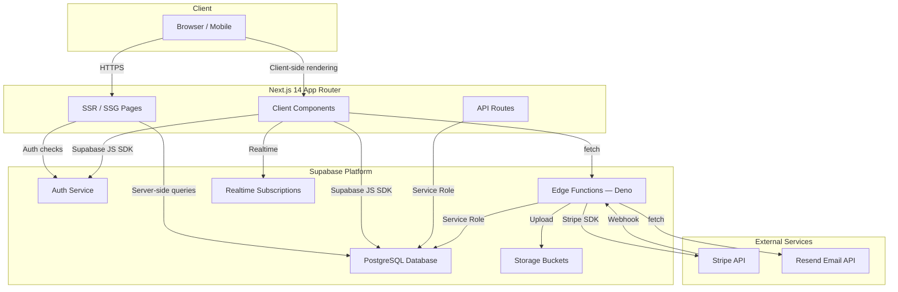

### 1.8 Development Philosophy

| Principle | Implementation |
|-----------|---------------|
| Security first | RLS on every table, fixed search_path on all functions, CSP headers, SECURITY INVOKER views |
| Type safety | Strict TypeScript, no implicit any, typed Supabase responses |
| Convention over configuration | Next.js App Router file-based routing, Tailwind component classes |
| Progressive enhancement | Core booking flow works without JavaScript; enhancements layered on top |
| Accessibility as a requirement | WCAG 2.1 AA compliance, skip links, ARIA landmarks, keyboard navigation |
| Performance budget | Under 100 kB shared JS bundle, lazy-loaded routes, AVIF/WebP images |
| GDPR by design | Cookie consent, data retention policies, user data export and deletion rights |

---

## 2. System Architecture

### 2.1 Architecture Overview

PureMaids uses a serverless-first architecture where the database is the source of truth and Edge Functions handle business logic that cannot be expressed in SQL alone. The frontend communicates with the database directly via the Supabase JS SDK (using the anon key with RLS) for CRUD operations, and via Edge Functions for operations requiring secrets (Stripe, Resend).

### 2.2 Component Diagram

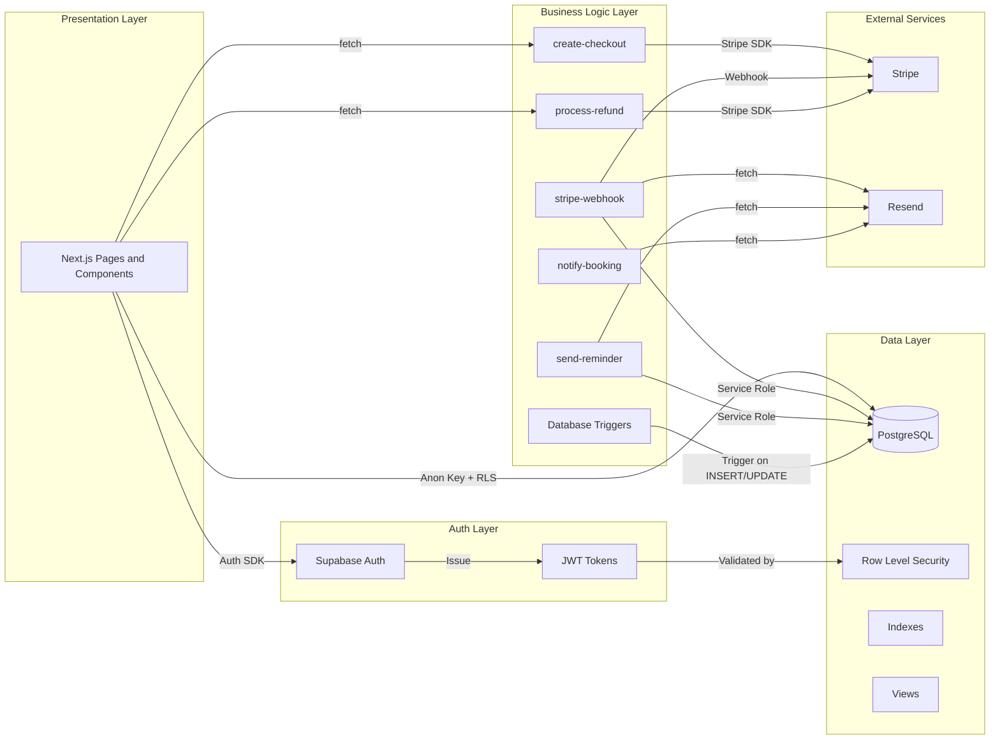

### 2.3 Frontend

The frontend is a Next.js 14 App Router application. Pages are either server-rendered (dynamic) or statically generated at build time. Client components use the `'use client'` directive for interactivity.

| Concern | Technology | Notes |
|---------|-----------|-------|
| Routing | App Router (app/ directory) | File-based, nested layouts |
| Rendering | SSR + SSG | force-dynamic for pages with live data; static for content pages |
| Styling | Tailwind CSS 3.4 | Custom design system with brand/accent colour ramps |
| Fonts | next/font (Inter + Plus Jakarta Sans) | display: swap to prevent layout shift |
| Images | next/image | AVIF/WebP, lazy loading, priority for hero |
| Animations | Tailwind animation + keyframes | prefers-reduced-motion respected |
| State | React useState/useEffect | No global state library |
| API calls | fetch() to Edge Functions | Supabase JS SDK for direct DB queries |

### 2.4 Backend

The backend is Supabase Edge Functions (Deno runtime) for operations requiring server-side secrets, and PostgreSQL triggers and functions for data-level automation.

| Function | Purpose | Auth |
|----------|---------|------|
| create-checkout | Creates Stripe Checkout sessions for bookings and subscriptions | Anon key (public) |
| stripe-webhook | Receives Stripe webhook events, updates payment/booking status | Stripe webhook signature |
| process-refund | Issues full or partial refunds via Stripe | User JWT (admin-only via RLS) |
| send-reminder | Sends booking reminder emails via Resend | Supabase service role (cron-triggered) |
| notify-booking | Sends booking confirmation/notification emails via Resend | Supabase service role (triggered by webhook) |

### 2.5 Database

PostgreSQL 15 hosted on Supabase. The database contains 22 tables, 2 views, 14 functions, and 14 triggers. Row Level Security is enabled on every table.

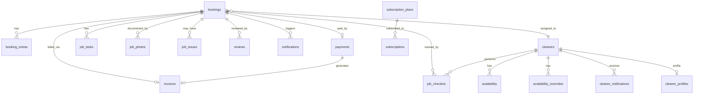

### 2.6 Authentication

Supabase Auth provides JWT-based authentication. The platform uses email/password authentication. Sessions are managed by the Supabase JS SDK, which stores the access token and refresh token in browser storage.

| Aspect | Implementation |
|--------|---------------|
| Provider | Supabase Auth (email/password) |
| Token type | JWT (access token) + refresh token |
| Token storage | Browser localStorage (default) |
| Token refresh | Automatic via Supabase JS SDK |
| Email confirmation | Disabled (per product requirement) |
| MFA | Not currently implemented (roadmap) |
| Password reset | Supabase Auth resetPasswordForEmail() |

### 2.7 Payments

Stripe handles all payment processing. The platform uses Stripe Checkout for one-time payments (deposits and full payments) and Stripe Subscriptions for recurring cleaning plans.

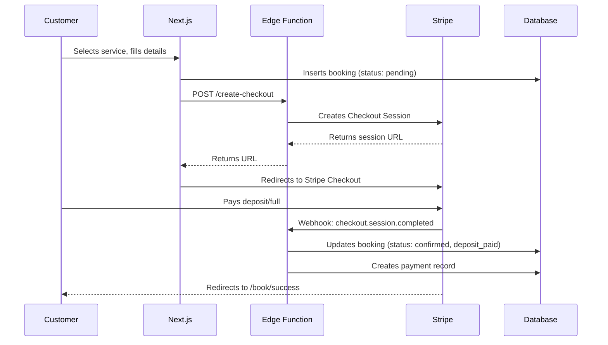

### 2.8 Storage

Supabase Storage is used for invoice PDFs and job photos.

| Bucket | Contents | Access |
|--------|----------|--------|
| invoices | Generated PDF invoices | Customer can read own invoices; admin can read all |
| job-photos | Before/after photos uploaded by cleaners | Cleaner can read/write own; admin can read all |

### 2.9 Email

Transactional emails are sent via Resend through Edge Functions.

| Trigger | Sent by |
|---------|---------|
| Booking confirmed | notify-booking Edge Function |
| Booking reminder (24h before) | send-reminder Edge Function (cron) |
| Payment receipt | stripe-webhook Edge Function |
| Refund processed | process-refund Edge Function |

### 2.10 Notifications

In-app notifications are generated by a PostgreSQL trigger (notify_on_booking_status_change) that fires on bookings table updates. When a booking status changes to confirmed, completed, or cancelled, a row is inserted into the notifications table.

### 2.11 API

The platform exposes two types of API:

1. Supabase REST API (auto-generated from PostgreSQL) at /rest/v1/ for all tables with RLS
2. Edge Functions (Deno) at /functions/v1/ for business logic

### 2.12 Caching

| Layer | Strategy |
|-------|----------|
| Next.js | Static generation for content pages (privacy, terms, cookies) |
| Browser | Cache-Control headers set via Next.js config |
| Supabase | Connection pooling via PgBouncer |
| CDN | Bolt edge CDN caches static assets |

### 2.13 Analytics

Analytics are not currently implemented. The cookie banner includes an analytics toggle (disabled by default) for future Google Analytics 4 integration.

### 2.14 Logging

| Layer | What is logged |
|-------|---------------|
| Edge Functions | console.log() output captured by Supabase |
| Database | Trigger-based audit logging (roadmap) |
| Client | Error boundary captures and displays errors |
| Stripe | Payment events logged in payments table |

### 2.15 Monitoring

| Aspect | Tool | Notes |
|---------|------|-------|
| Uptime | Bolt platform monitoring | Automatic health checks |
| Database | Supabase dashboard | Query performance, connection count |
| Edge Functions | Supabase dashboard | Invocation count, error rate, latency |
| Stripe | Stripe dashboard | Payment success rate, webhook delivery |

### 2.16 Deployment

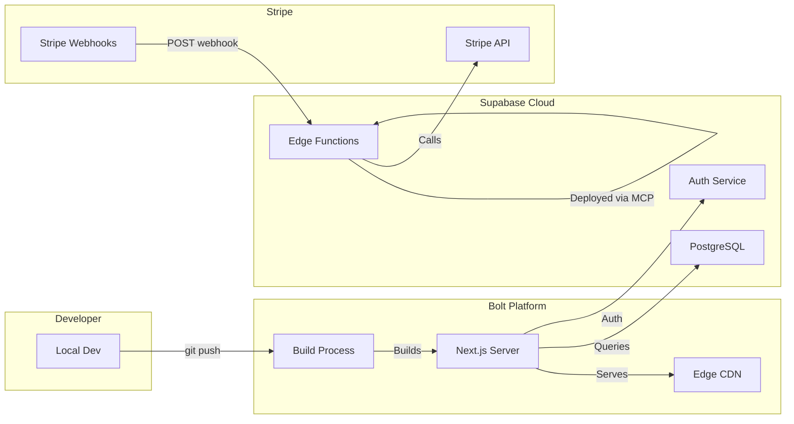

---

## 3. Project Structure

### 3.1 Directory Tree

```
puremaids/
├── app/                          # Next.js App Router
│   ├── globals.css               # Global styles + Tailwind + design system
│   ├── layout.tsx                # Root layout (fonts, SEO, schema.org, cookie banner)
│   ├── page.tsx                  # Homepage
│   ├── loading.tsx               # Route-level loading spinner
│   ├── not-found.tsx             # Custom 404 page
│   ├── global-error.tsx          # Global error boundary
│   ├── book/                     # Booking flow
│   │   ├── page.tsx              # 3-step booking wizard
│   │   ├── success/page.tsx      # Stripe success redirect
│   │   └── cancel/page.tsx       # Stripe cancel redirect
│   ├── subscriptions/            # Subscription plans
│   │   ├── page.tsx              # Plan cards + checkout
│   │   ├── success/page.tsx
│   │   └── cancel/page.tsx
│   ├── account/                  # Customer portal (authenticated)
│   │   └── invoices/page.tsx     # Invoice list
│   ├── admin/                    # Admin panel
│   │   └── refunds/page.tsx      # Refund management
│   ├── privacy/page.tsx          # GDPR privacy policy
│   ├── terms/page.tsx            # Terms and conditions
│   └── cookies/page.tsx          # Cookie policy
├── components/
│   ├── layout/
│   │   ├── Nav.tsx               # Sticky nav with mobile drawer
│   │   └── Footer.tsx            # Footer with trust signals
│   ├── ui/
│   │   ├── Spinner.tsx           # Accessible loading spinner
│   │   ├── ErrorBoundary.tsx     # React error boundary
│   │   └── Stars.tsx             # Star rating component
│   └── gdpr/
│       └── CookieBanner.tsx      # Cookie consent with granular toggles
├── lib/
│   ├── constants.ts              # Business constants (services, prices, areas)
│   ├── pricing.ts                # Price calculation and formatting
│   ├── stripe-api.ts             # Client-side Stripe API wrappers
│   ├── subscription-plans.ts     # Subscription plan definitions
│   └── supabase-client.ts        # Supabase client singleton
├── public/
│   ├── manifest.json             # PWA manifest
│   └── robots.txt                # Crawler directives
├── supabase/
│   └── functions/                # Edge Functions (Deno)
├── package.json
├── next.config.js                # Security headers, image optimisation
├── tailwind.config.js            # Theme, colours, animations
├── postcss.config.js
├── tsconfig.json
└── README.md                     # This document
```

### 3.2 Folder Purposes

| Folder | Purpose |
|--------|---------|
| app/ | Next.js App Router — all pages, layouts, route-level error/loading states |
| components/ | Shared React components organised by domain (layout, ui, gdpr) |
| lib/ | Business logic, constants, API wrappers, Supabase client |
| public/ | Static files served at root URL (manifest, robots.txt, icons) |
| supabase/functions/ | Deno Edge Functions deployed to Supabase |

### 3.3 Key File Reference

| File | Role |
|------|------|
| app/layout.tsx | Root HTML shell — fonts, head, metadata, schema.org JSON-LD, skip link, cookie banner |
| app/globals.css | Tailwind layers + design system (buttons, cards, inputs, badges, alerts, animations) |
| app/page.tsx | Homepage with 7 sections: hero, stats, trust badges, services, how-it-works, reviews, areas, FAQ, CTA |
| app/book/page.tsx | 3-step booking wizard with live price calculation and Stripe Checkout integration |
| lib/constants.ts | All business data: services, extras, pricing, service areas, reviews, trust stats |
| lib/pricing.ts | calcPrice() function for deposit/total calculation, GBP and date formatting |
| lib/stripe-api.ts | fetch() wrappers for create-checkout and process-refund Edge Functions |
| lib/supabase-client.ts | Lazy-initialised Supabase client via Proxy |
| next.config.js | Security headers (CSP, HSTS, X-Frame-Options), image optimisation |
| tailwind.config.js | Brand/accent colour ramps, custom animations |
| components/layout/Nav.tsx | Sticky nav with scroll-based transparency, mobile drawer |
| components/gdpr/CookieBanner.tsx | GDPR consent with analytics/marketing toggles, localStorage persistence |

---

## 4. Installation

### 4.1 Prerequisites

| Requirement | Minimum Version | Notes |
|-------------|-----------------|-------|
| Node.js | 20.x | Use nvm use 20 or fnm use 20 |
| npm | 10.x | Comes with Node 20 |
| Git | 2.40+ | For version control |
| Supabase account | — | Project must be provisioned |
| Stripe account | — | API keys required for payments |
| Resend account | — | API key required for transactional email |

### 4.2 Environment Setup

The Supabase project is already provisioned. The following credentials are pre-populated in the environment:

- NEXT_PUBLIC_SUPABASE_URL
- NEXT_PUBLIC_SUPABASE_ANON_KEY
- SUPABASE_SERVICE_ROLE_KEY (server-only)
- STRIPE_SECRET_KEY (Edge Function secret)
- RESEND_API_KEY (Edge Function secret)
- STRIPE_WEBHOOK_SECRET (Edge Function secret)
- SITE_URL (Edge Function secret)

### 4.3 Development Setup

```bash
git clone <repo-url> puremaids
cd puremaids
npm install
cp .env.example .env.local
# Edit .env.local with your values
npm run dev
# App available at http://localhost:3000
```

### 4.4 Production Setup

```bash
npm ci
npm run build
npm start
```

### 4.5 Stripe Webhook Setup (Local Development)

```bash
# Install Stripe CLI: https://stripe.com/docs/stripe-cli
stripe listen --forward-to https://<project>.supabase.co/functions/v1/stripe-webhook
# Copy the webhook signing secret and add as Edge Function secret
```

### 4.6 Edge Function Deployment

Edge Functions are deployed using the Supabase MCP deploy_edge_function tool. Write the function source to supabase/functions/<slug>/index.ts, then deploy.

Currently deployed Edge Functions:

| Slug | verify_jwt | Purpose |
|------|------------|---------|
| create-checkout | false | Creates Stripe Checkout sessions |
| stripe-webhook | false | Receives Stripe webhooks (verified by signature) |
| process-refund | false | JWT verified inside function via admin_profiles RLS |
| send-reminder | false | Cron-triggered reminder emails |
| notify-booking | false | Booking notification emails |

---

## 5. Environment Variables

### 5.1 Complete Variable Reference

| Variable | Purpose | Required | Example | Security Notes |
|----------|---------|----------|---------|----------------|
| NEXT_PUBLIC_SUPABASE_URL | Supabase project URL for client SDK | Yes | https://xyz.supabase.co | Public — safe in browser |
| NEXT_PUBLIC_SUPABASE_ANON_KEY | Supabase anon key for client queries (RLS-protected) | Yes | eyJhbGciOi... | Public — RLS enforces access |
| SUPABASE_SERVICE_ROLE_KEY | Service role key for Edge Functions (bypasses RLS) | Yes (server) | eyJhbGciOi... | NEVER expose in client code |
| SUPABASE_URL | Same as public URL, used by Edge Functions | Yes (server) | https://xyz.supabase.co | Server-only |
| SUPABASE_ANON_KEY | Same as anon key, used by Edge Functions | Yes (server) | eyJhbGciOi... | Server-only |
| STRIPE_SECRET_KEY | Stripe API secret key | Yes (server) | sk_live_... | NEVER expose in client code |
| STRIPE_WEBHOOK_SECRET | Stripe webhook signing secret | Yes (server) | whsec_... | Server-only |
| RESEND_API_KEY | Resend API key for transactional email | Yes (server) | re_... | Server-only |
| SITE_URL | Public site URL for Stripe redirects | Yes (server) | https://puremaids.co.uk | Used in success/cancel URLs |

### 5.2 Edge Function Secrets

| Secret Name | Used By |
|-------------|---------|
| SUPABASE_URL | All functions |
| SUPABASE_ANON_KEY | create-checkout |
| SUPABASE_SERVICE_ROLE_KEY | stripe-webhook, send-reminder, notify-booking, process-refund |
| STRIPE_SECRET_KEY | create-checkout, process-refund, stripe-webhook |
| STRIPE_WEBHOOK_SECRET | stripe-webhook |
| RESEND_API_KEY | send-reminder, notify-booking |
| SITE_URL | create-checkout, stripe-webhook |

### 5.3 Security Rules

1. Never commit .env files to git. Add .env and .env.local to .gitignore.
2. Never use SUPABASE_SERVICE_ROLE_KEY in client-side code. It bypasses RLS entirely.
3. Never use STRIPE_SECRET_KEY in client-side code. It can create charges.
4. Prefix client-safe variables with NEXT_PUBLIC_. Next.js only exposes these to the browser.
5. Rotate keys regularly, especially after team member departures.

---

## 6. User Types

### 6.1 User Type Overview

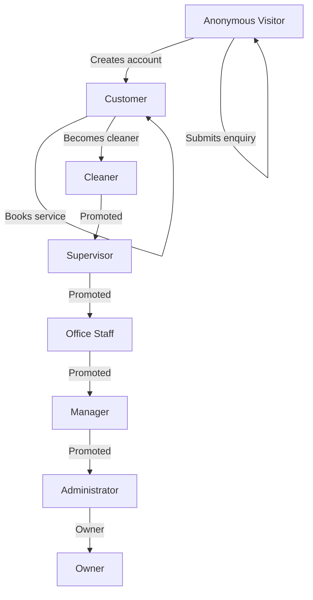

### 6.2 Anonymous Visitor

| Aspect | Description |
|--------|-------------|
| Purpose | Prospective customer browsing, getting quotes, submitting enquiries |
| Authentication | None — operates under the anon role |
| Database identity | No auth.uid() |
| Allowed actions | View public pages; get instant quotes; submit guest bookings; submit contact enquiries |
| Restricted actions | Cannot view invoices, bookings, account pages; cannot access admin; cannot subscribe (requires login) |
| Security rules | RLS for anon on bookings (INSERT: user_id IS NULL, status = pending), booking_extras (INSERT: referenced booking unowned), contact_enquiries (INSERT: status = new) |

### 6.3 Customer

| Aspect | Description |
|--------|-------------|
| Purpose | Authenticated user who books and manages cleaning services |
| Authentication | Supabase Auth (email/password) |
| Database identity | auth.uid() linked via customer_profiles.user_id |
| Allowed actions | Everything anon can do, plus: view own bookings, invoices, subscribe to plans, leave reviews, manage saved addresses, receive notifications |
| Restricted actions | Cannot view other customers data; cannot access admin or cleaner pages; cannot modify booking status |
| Security rules | RLS enforces auth.uid() = user_id on all customer-facing tables |

### 6.4 Cleaner

| Aspect | Description |
|--------|-------------|
| Purpose | Field staff who perform cleaning jobs |
| Authentication | Supabase Auth (email/password) |
| Database identity | auth.uid() linked via cleaner_profiles.user_id to cleaner_profiles.cleaner_id to cleaners.id |
| Allowed actions | View assigned bookings; check in/out; complete tasks; upload photos; report issues; manage availability; receive notifications |
| Restricted actions | Cannot view unassigned bookings; cannot modify booking status; cannot access customer contact beyond job needs; cannot access financial data |
| Security rules | RLS checks assigned_cleaner_id IN (SELECT cleaner_id FROM cleaner_profiles WHERE user_id = auth.uid()) |

### 6.5 Supervisor

| Aspect | Description |
|--------|-------------|
| Purpose | Senior cleaner overseeing a team |
| Authentication | Supabase Auth (email/password) |
| Database identity | admin_profiles with role = supervisor |
| Allowed actions | Everything a cleaner can do, plus: view team bookings, reassign within team, approve/reject issues |
| Restricted actions | Cannot process refunds, manage subscription plans, access revenue reports |
| Security rules | Admin RLS policies with application-level role checks |

### 6.6 Office Staff

| Aspect | Description |
|--------|-------------|
| Purpose | Administrative support for day-to-day operations |
| Authentication | Supabase Auth (email/password) |
| Database identity | admin_profiles with role = staff |
| Allowed actions | View all bookings; assign cleaners; update booking status; respond to enquiries; view all cleaners and availability |
| Restricted actions | Cannot process refunds, delete bookings, manage admin accounts |
| Security rules | Admin RLS policies check EXISTS (SELECT 1 FROM admin_profiles WHERE user_id = auth.uid()) |

### 6.7 Manager

| Aspect | Description |
|--------|-------------|
| Purpose | Senior staff overseeing operations |
| Authentication | Supabase Auth (email/password) |
| Database identity | admin_profiles with role = manager |
| Allowed actions | Everything office staff can do, plus: process refunds, view revenue reports, manage subscription plans, manage cleaner profiles |
| Restricted actions | Cannot manage admin accounts |
| Security rules | Admin RLS policies + application-level role checks |

### 6.8 Administrator

| Aspect | Description |
|--------|-------------|
| Purpose | System administrator with full access |
| Authentication | Supabase Auth (email/password) |
| Database identity | admin_profiles with role = admin |
| Allowed actions | Full CRUD on all tables; manage admin accounts; configure system; process refunds; view all data |
| Restricted actions | None within the application |
| Security rules | Admin RLS policies grant full access based on admin_profiles membership |

### 6.9 Owner

| Aspect | Description |
|--------|-------------|
| Purpose | Business owner with ultimate authority |
| Authentication | Supabase Auth (email/password) |
| Database identity | admin_profiles with role = owner |
| Allowed actions | Everything an administrator can do, plus: dissolve business, transfer ownership, access audit logs |
| Restricted actions | None |
| Security rules | Same as administrator; owner is a conceptual role distinction |

### 6.10 Role Summary Table

| Role | admin_profiles.role | Bookings | Refunds | Revenue | Admin Mgmt | Cleaners |
|------|---------------------|----------|---------|---------|------------|----------|
| Anonymous | — | Create (guest) | No | No | No | No |
| Customer | — | Own only | No | No | No | No |
| Cleaner | — | Assigned only | No | No | No | Own profile |
| Supervisor | supervisor | Team | No | No | No | Team |
| Office Staff | staff | All | No | No | No | All |
| Manager | manager | All | Yes | Yes | No | All |
| Administrator | admin | All | Yes | Yes | Yes | All |
| Owner | owner | All | Yes | Yes | Yes | All |

---

## 7. User Journeys

### 7.1 Primary Journey: Visitor to Repeat Customer

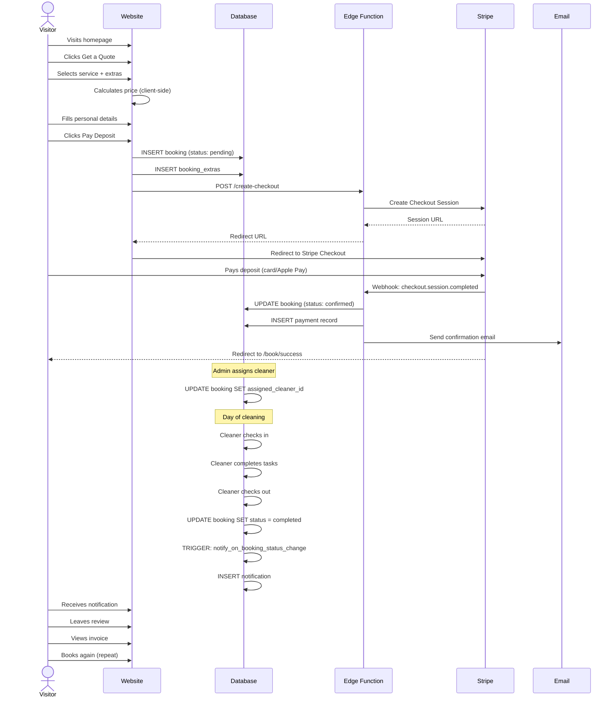

### 7.2 Guest Booking Journey (No Account)

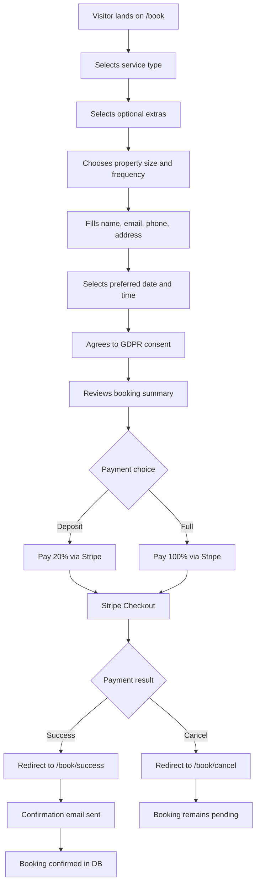

### 7.3 Subscription Journey

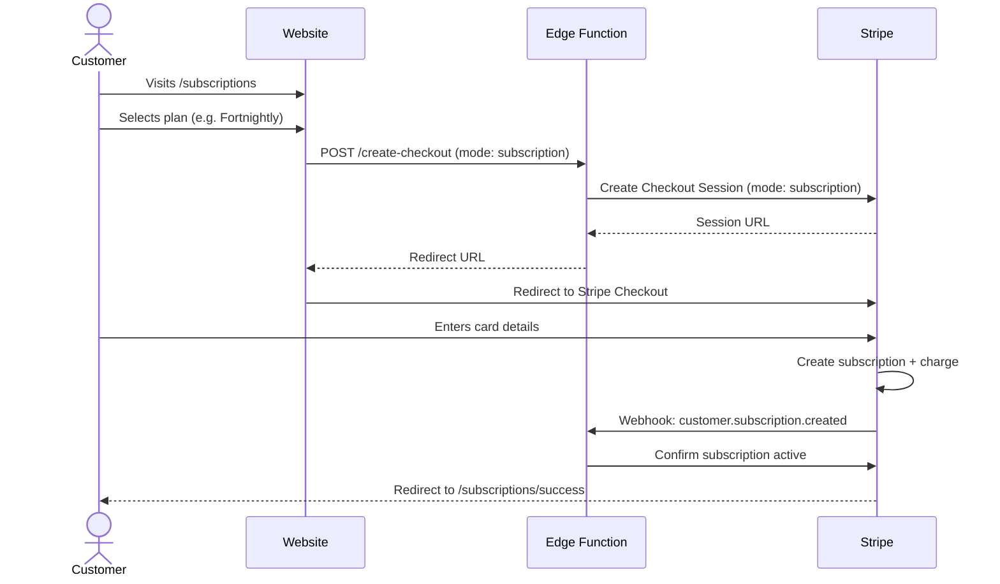

### 7.4 Cleaner Daily Workflow

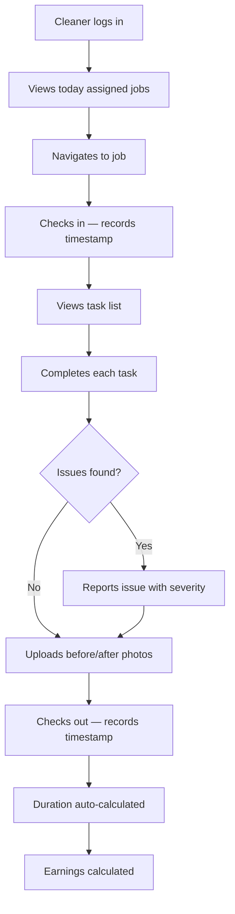

### 7.5 Admin Refund Journey

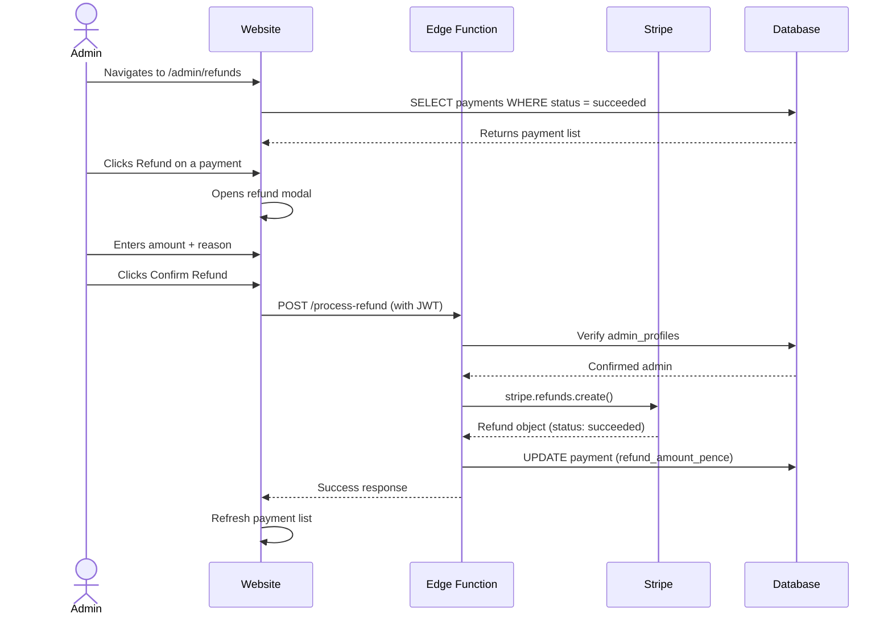

### 7.6 Notification Journey

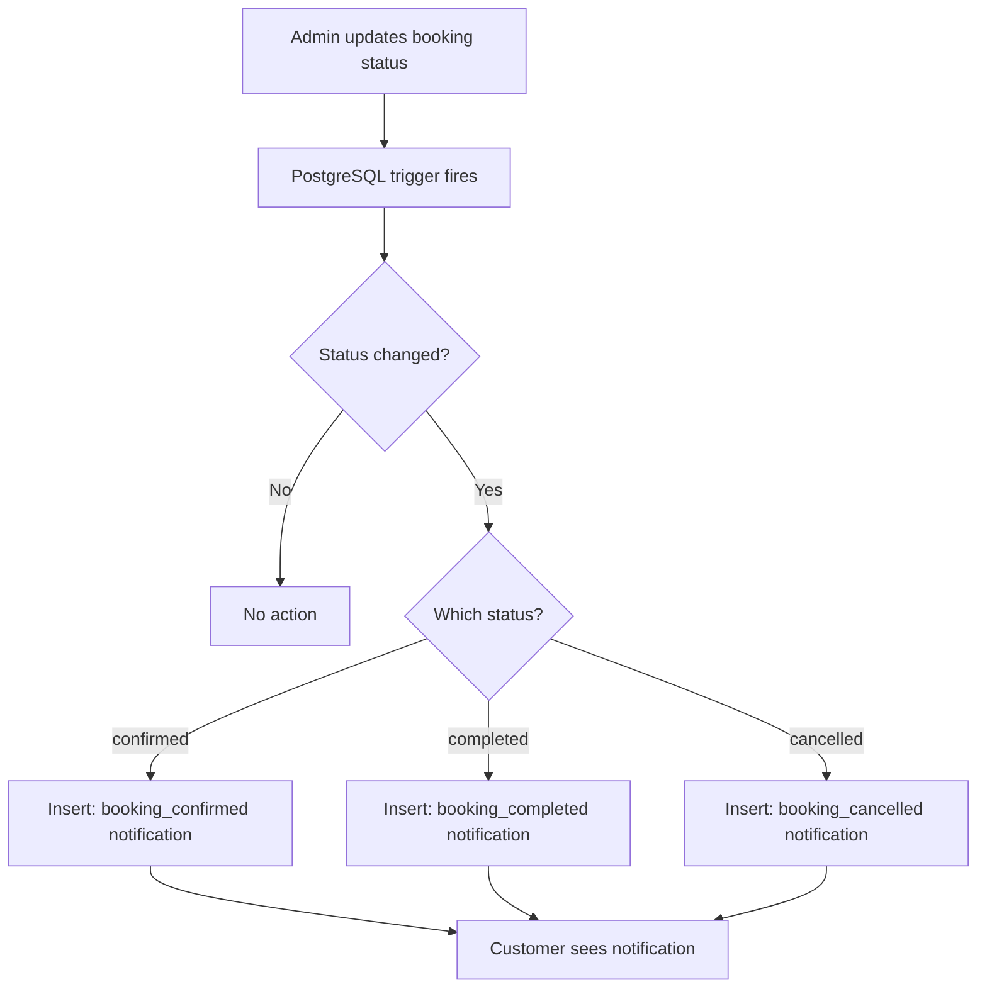

### 7.7 Complete Booking Lifecycle

The full journey from visitor to repeat customer follows these stages:

| Stage | Actor | Action | System Response |
|-------|-------|--------|-----------------|
| 1. Visitor | Anonymous | Browses homepage | SSR page with services, reviews, FAQ |
| 2. Quote | Anonymous | Selects service + extras | Client-side price calculation |
| 3. Booking | Anonymous | Fills details, agrees to GDPR | INSERT into bookings (status: pending) |
| 4. Payment | Anonymous | Pays deposit or full via Stripe | Edge Function creates Checkout Session |
| 5. Confirmation | Stripe | Webhook received | Booking updated to confirmed, payment recorded |
| 6. Cleaner Assigned | Admin | Assigns cleaner to booking | UPDATE booking SET assigned_cleaner_id |
| 7. Job Started | Cleaner | Checks in at property | INSERT into job_checkins |
| 8. Job Completed | Cleaner | Completes tasks, checks out | UPDATE booking SET status = completed |
| 9. Review | Customer | Rates and reviews service | INSERT into reviews |
| 10. Invoice | System | Generates invoice | INSERT into invoices with auto-number |
| 11. Repeat Booking | Customer | Books again or subscribes | New booking or subscription record |

---

## 8. Database

### 8.1 Database Overview

The PureMaids database runs on PostgreSQL 15 hosted by Supabase. It contains 22 tables, 2 views, 14 functions (all with fixed search_path = public, pg_catalog), and 14 triggers. Row Level Security is enabled on every table.

### 8.2 Migration History

| Migration File | Description |
|----------------|-------------|
| 20260702223206_create_puremaids_schema.sql | Initial schema: bookings, booking_extras, cleaners, reviews, contact_enquiries |
| 20260702231914_upgrade_booking_system.sql | Added booking reference, pricing, user_id, assigned_cleaner_id, deposit fields |
| 20260703113903_create_admin_system.sql | Created admin_profiles table with role hierarchy |
| 20260703114617_admin_profiles_insert_policy.sql | RLS policy for admin self-insert |
| 20260703121751_create_customer_portal.sql | Customer profiles, saved addresses, referrals |
| 20260704223501_create_staff_portal.sql | Cleaner profiles, job checkins, tasks, photos, issues, notifications, availability |
| 20260705221245_20260705_001_create_payments_table.sql | Payments table with Stripe integration |
| 20260705221313_20260705_002_create_invoices_table.sql | Invoices table with auto-numbering |
| 20260705221347_20260705_003_create_availability_tables.sql | Availability and overrides tables |
| 20260705221418_20260705_004_create_notifications_table.sql | Customer notifications table |
| 20260705221454_20260705_005_production_hardening.sql | RLS policies, indexes, security hardening |
| 20260710004857_20260710_001_create_subscription_tables.sql | Subscription plans and subscriptions tables |
| 20260713154052_20260713_001_fix_security_issues.sql | Fixed SECURITY DEFINER views, mutable search_path, always-true RLS policies |

### 8.3 Entity-Relationship Diagram

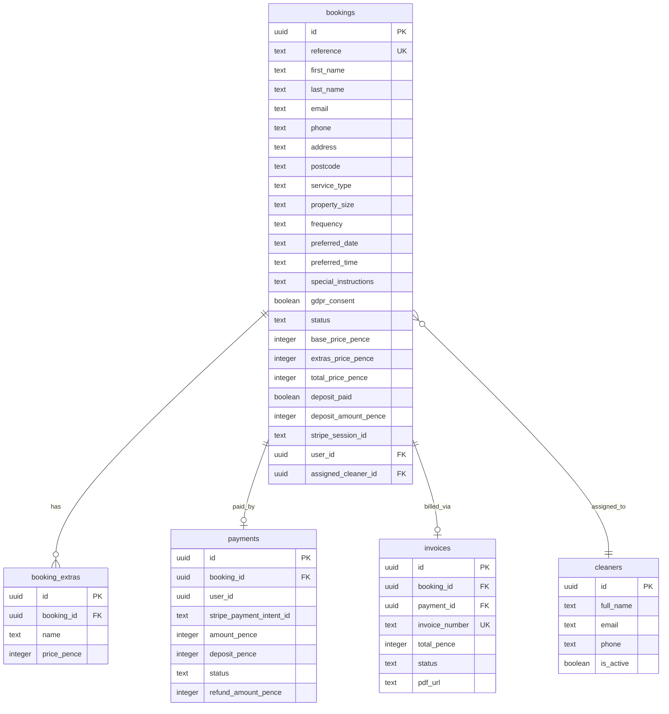

### 8.4 Table: bookings

**Purpose**: Central table storing all cleaning bookings — the core entity of the platform.

| Column | Type | Nullable | Default | Description |
|--------|------|----------|---------|-------------|
| id | uuid | NOT NULL | gen_random_uuid() | Primary key |
| first_name | text | NOT NULL | — | Customer first name |
| last_name | text | NOT NULL | — | Customer last name |
| email | text | NOT NULL | — | Customer email |
| phone | text | NOT NULL | — | Customer phone |
| address | text | NOT NULL | — | Property address |
| postcode | text | NOT NULL | — | Property postcode |
| service_type | text | NOT NULL | — | Service key (domestic, deep, end_of_tenancy, office) |
| property_size | text | NULL | — | Property size (e.g. 2 bedrooms) |
| frequency | text | NOT NULL | one_off | Frequency (one_off, weekly, fortnightly, monthly) |
| preferred_date | text | NOT NULL | — | Customer preferred date |
| preferred_time | text | NOT NULL | — | Customer preferred time slot |
| special_instructions | text | NULL | — | Free-text instructions |
| gdpr_consent | boolean | NOT NULL | false | Customer agreed to privacy policy |
| status | text | NOT NULL | pending | Lifecycle: pending to confirmed to completed/cancelled |
| created_at | timestamptz | NULL | now() | Creation timestamp |
| reference | text | NULL | (trigger) | Human-readable reference (PM-XXXXXXXX) |
| base_price_pence | integer | NOT NULL | 0 | Base service price in pence |
| extras_price_pence | integer | NOT NULL | 0 | Sum of extras prices in pence |
| total_price_pence | integer | NOT NULL | 0 | Total booking price in pence |
| deposit_paid | boolean | NULL | false | Whether deposit has been paid |
| deposit_amount_pence | integer | NULL | — | Deposit amount in pence (20% of total) |
| stripe_session_id | text | NULL | — | Stripe Checkout Session ID |
| user_id | uuid | NULL | — | Linked auth user (NULL for guest bookings) |
| assigned_cleaner_id | uuid | NULL | — | FK to cleaners.id |
| updated_at | timestamptz | NOT NULL | now() | Last update (trigger-maintained) |
| notes | text | NULL | — | Public notes (visible to customer) |
| internal_notes | text | NULL | — | Private admin notes |

**Primary Key**: id
**Foreign Keys**: assigned_cleaner_id to cleaners.id
**Unique Constraint**: reference

**Triggers**:
- bookings_set_reference (BEFORE INSERT) calls set_booking_reference() to auto-generate reference
- bookings_updated_at (BEFORE UPDATE) calls update_updated_at() to set updated_at = now()
- bookings_notify_customer (AFTER UPDATE) calls notify_on_booking_status_change() to create notifications

**RLS Policies**:

| Policy | Role | Command | Condition |
|--------|------|---------|-----------|
| anon_insert_bookings | anon | INSERT | user_id IS NULL AND status = pending AND deposit_paid = false AND stripe_session_id IS NULL |
| auth_insert_own_bookings | authenticated | INSERT | (user_id IS NULL OR user_id = auth.uid()) AND status = pending |
| anon_select_bookings | anon, authenticated | SELECT | true (public booking visibility) |
| customers_select_own_bookings | authenticated | SELECT | auth.uid() = user_id |
| customers_update_own_bookings | authenticated | UPDATE | auth.uid() = user_id |
| cleaner_select_assigned | authenticated | SELECT | assigned_cleaner_id IN (SELECT cleaner_id FROM cleaner_profiles WHERE user_id = auth.uid()) |
| cleaner_update_assigned | authenticated | UPDATE | Same as above |
| admin_select_bookings | authenticated | SELECT | EXISTS (SELECT 1 FROM admin_profiles WHERE user_id = auth.uid()) |
| admin_update_bookings | authenticated | UPDATE | Same admin check |
| admin_delete_bookings | authenticated | DELETE | Same admin check |

**Example Query** — Get a customer bookings with extras:
```sql
SELECT b.id, b.reference, b.status, b.preferred_date,
       b.service_type, b.total_price_pence, b.deposit_paid,
       COALESCE(json_agg(json_build_object('name', be.name, 'price', be.price_pence))
         FILTER (WHERE be.id IS NOT NULL), '[]') AS extras
FROM bookings b
LEFT JOIN booking_extras be ON be.booking_id = b.id
WHERE b.user_id = auth.uid()
GROUP BY b.id
ORDER BY b.preferred_date DESC;
```

### 8.5 Table: booking_extras

**Purpose**: Stores optional add-on services for a booking (oven clean, fridge clean, etc.).

| Column | Type | Nullable | Default | Description |
|--------|------|----------|---------|-------------|
| id | uuid | NOT NULL | gen_random_uuid() | Primary key |
| booking_id | uuid | NOT NULL | — | FK to bookings.id |
| name | text | NOT NULL | — | Extra service name |
| price_pence | integer | NOT NULL | 0 | Price in pence |
| created_at | timestamptz | NOT NULL | now() | Creation timestamp |

**Primary Key**: id
**Foreign Key**: booking_id to bookings.id (ON DELETE CASCADE)
**Index**: idx_booking_extras_booking_id on booking_id

**RLS Policies**: anon INSERT (referenced booking must be unowned pending); authenticated INSERT (referenced booking owned by caller or unowned pending); public SELECT; admin SELECT; cleaner SELECT (assigned booking).

### 8.6 Table: cleaners

**Purpose**: Stores cleaner profiles (field staff who perform cleaning jobs).

| Column | Type | Nullable | Default | Description |
|--------|------|----------|---------|-------------|
| id | uuid | NOT NULL | gen_random_uuid() | Primary key |
| full_name | text | NOT NULL | — | Cleaner full name |
| email | text | NULL | — | Cleaner email |
| phone | text | NULL | — | Cleaner phone |
| is_active | boolean | NOT NULL | true | Whether currently active |
| created_at | timestamptz | NOT NULL | now() | Creation timestamp |
| updated_at | timestamptz | NOT NULL | now() | Last update |

**Triggers**: cleaners_updated_at calls update_cleaners_updated_at()
**RLS Policies**: Admin full CRUD; cleaners SELECT own (via cleaner_profiles link); anon/authenticated SELECT active cleaners.

### 8.7 Table: cleaner_profiles

**Purpose**: Links a Supabase Auth user to a cleaner record, enabling login.

| Column | Type | Nullable | Default | Description |
|--------|------|----------|---------|-------------|
| id | uuid | NOT NULL | gen_random_uuid() | Primary key |
| user_id | uuid | NOT NULL | — | FK to auth.users.id |
| cleaner_id | uuid | NOT NULL | — | FK to cleaners.id |
| hourly_rate_pence | integer | NOT NULL | 1200 | Hourly rate in pence (default 12.00/hr) |
| created_at | timestamptz | NOT NULL | now() | Creation timestamp |

**Unique Constraint**: user_id (one cleaner profile per auth user)

### 8.8 Table: admin_profiles

**Purpose**: Identifies which Supabase Auth users are administrators and their role level.

| Column | Type | Nullable | Default | Description |
|--------|------|----------|---------|-------------|
| id | uuid | NOT NULL | gen_random_uuid() | Primary key |
| user_id | uuid | NOT NULL | — | FK to auth.users.id |
| full_name | text | NOT NULL | '' | Admin display name |
| role | text | NOT NULL | admin | Role: admin, manager, staff, supervisor, owner |
| created_at | timestamptz | NOT NULL | now() | Creation timestamp |

**Unique Constraint**: user_id
**RLS Policies**: Self-select (auth.uid() = user_id), self-insert (auth.uid() = user_id).

### 8.9 Table: customer_profiles

**Purpose**: Extended profile information for authenticated customers.

| Column | Type | Nullable | Default | Description |
|--------|------|----------|---------|-------------|
| id | uuid | NOT NULL | gen_random_uuid() | Primary key |
| user_id | uuid | NOT NULL | — | FK to auth.users.id |
| full_name | text | NOT NULL | '' | Customer display name |
| phone | text | NULL | — | Phone number |
| created_at | timestamptz | NOT NULL | now() | Creation timestamp |
| updated_at | timestamptz | NOT NULL | now() | Last update |

### 8.10 Table: payments

**Purpose**: Records all payment transactions synced from Stripe.

| Column | Type | Nullable | Default | Description |
|--------|------|----------|---------|-------------|
| id | uuid | NOT NULL | gen_random_uuid() | Primary key |
| booking_id | uuid | NOT NULL | — | FK to bookings.id |
| user_id | uuid | NULL | — | Auth user ID |
| stripe_payment_intent_id | text | NULL | — | Stripe Payment Intent ID |
| stripe_charge_id | text | NULL | — | Stripe Charge ID |
| stripe_customer_id | text | NULL | — | Stripe Customer ID |
| amount_pence | integer | NOT NULL | 0 | Total amount charged |
| deposit_pence | integer | NOT NULL | 0 | Deposit portion |
| currency | text | NOT NULL | gbp | ISO currency code |
| status | text | NOT NULL | pending | pending, succeeded, failed, partially_refunded, refunded |
| payment_method | text | NOT NULL | card | Payment method type |
| description | text | NULL | — | Payment description |
| failure_reason | text | NULL | — | Failure reason if status = failed |
| refund_amount_pence | integer | NOT NULL | 0 | Total refunded amount |
| refunded_at | timestamptz | NULL | — | When refund was processed |
| metadata | jsonb | NULL | {} | Additional Stripe metadata |
| created_at | timestamptz | NOT NULL | now() | Creation timestamp |
| updated_at | timestamptz | NOT NULL | now() | Last update |

**Triggers**: payments_updated_at calls update_payments_updated_at()
**RLS Policies**: Customers SELECT own (auth.uid() = user_id); admin SELECT/UPDATE all.

### 8.11 Table: invoices

**Purpose**: Generated invoices for completed or paid bookings.

| Column | Type | Nullable | Default | Description |
|--------|------|----------|---------|-------------|
| id | uuid | NOT NULL | gen_random_uuid() | Primary key |
| booking_id | uuid | NOT NULL | — | FK to bookings.id |
| payment_id | uuid | NULL | — | FK to payments.id |
| user_id | uuid | NULL | — | Auth user ID |
| invoice_number | text | NOT NULL | (trigger) | Auto-generated: INV-YYYY-NNNNN |
| invoice_date | date | NOT NULL | CURRENT_DATE | Invoice issue date |
| due_date | date | NOT NULL | CURRENT_DATE + 14 days | Payment due date |
| subtotal_pence | integer | NOT NULL | 0 | Pre-VAT subtotal |
| vat_rate | numeric | NOT NULL | 0.00 | VAT rate |
| vat_amount_pence | integer | NOT NULL | 0 | VAT amount |
| total_pence | integer | NOT NULL | 0 | Total including VAT |
| amount_paid_pence | integer | NOT NULL | 0 | Amount already paid |
| amount_due_pence | integer | NOT NULL | 0 | Outstanding amount |
| status | text | NOT NULL | draft | draft, sent, paid, overdue, void, cancelled |
| customer_name | text | NOT NULL | '' | Customer name (denormalised) |
| customer_email | text | NOT NULL | '' | Customer email |
| customer_address | text | NULL | — | Customer address |
| service_description | text | NULL | — | Service description |
| line_items | jsonb | NOT NULL | [] | JSON array of line items |
| notes | text | NULL | — | Invoice notes |
| pdf_url | text | NULL | — | URL to PDF in Storage |
| sent_at | timestamptz | NULL | — | When sent |
| paid_at | timestamptz | NULL | — | When paid |
| voided_at | timestamptz | NULL | — | When voided |
| created_at | timestamptz | NOT NULL | now() | Creation timestamp |
| updated_at | timestamptz | NOT NULL | now() | Last update |

**Unique Constraint**: invoice_number
**Triggers**: invoices_set_number calls generate_invoice_number(); invoices_updated_at calls update_invoices_updated_at()

### 8.12 Table: notifications

**Purpose**: In-app notifications for authenticated customers.

| Column | Type | Nullable | Default | Description |
|--------|------|----------|---------|-------------|
| id | uuid | NOT NULL | gen_random_uuid() | Primary key |
| user_id | uuid | NOT NULL | — | FK to auth.users.id |
| booking_id | uuid | NULL | — | FK to bookings.id |
| invoice_id | uuid | NULL | — | FK to invoices.id |
| type | text | NOT NULL | system | Notification type |
| title | text | NOT NULL | — | Title |
| body | text | NULL | — | Body text |
| action_url | text | NULL | — | URL for action |
| read | boolean | NOT NULL | false | Whether read |
| read_at | timestamptz | NULL | — | When read |
| sent_via_email | boolean | NOT NULL | false | Also sent via email |
| sent_via_sms | boolean | NOT NULL | false | Also sent via SMS |
| created_at | timestamptz | NOT NULL | now() | Creation timestamp |

**Index**: idx_notifications_user_unread on (user_id) WHERE read = false
**RLS Policies**: Users SELECT/UPDATE own; admin SELECT all.

### 8.13 Table: reviews

**Purpose**: Customer reviews and ratings for completed bookings.

| Column | Type | Nullable | Default | Description |
|--------|------|----------|---------|-------------|
| id | uuid | NOT NULL | gen_random_uuid() | Primary key |
| user_id | uuid | NOT NULL | — | FK to auth.users.id |
| booking_id | uuid | NOT NULL | — | FK to bookings.id |
| rating | smallint | NOT NULL | — | Rating 1 to 5 |
| title | text | NULL | — | Review title |
| body | text | NULL | — | Review body |
| created_at | timestamptz | NOT NULL | now() | Creation timestamp |
| updated_at | timestamptz | NOT NULL | now() | Last update |

**Triggers**: reviews_updated_at calls update_reviews_updated_at()

### 8.14 Table: contact_enquiries

**Purpose**: Contact form submissions from anonymous visitors.

| Column | Type | Nullable | Default | Description |
|--------|------|----------|---------|-------------|
| id | uuid | NOT NULL | gen_random_uuid() | Primary key |
| first_name | text | NOT NULL | — | First name |
| last_name | text | NOT NULL | — | Last name |
| email | text | NOT NULL | — | Email |
| phone | text | NOT NULL | — | Phone |
| service | text | NOT NULL | — | Service of interest |
| message | text | NOT NULL | — | Message |
| gdpr_consent | boolean | NOT NULL | false | GDPR consent |
| status | text | NOT NULL | new | new, responded, closed |
| created_at | timestamptz | NULL | now() | Creation timestamp |
| updated_at | timestamptz | NOT NULL | now() | Last update |

**RLS Policies**: Anon/authenticated INSERT with status = new; admin SELECT/UPDATE; anon SELECT denied (false).

### 8.15 Table: availability

**Purpose**: Cleaner availability slots — recurring (day of week) or specific dates.

| Column | Type | Nullable | Default | Description |
|--------|------|----------|---------|-------------|
| id | uuid | NOT NULL | gen_random_uuid() | Primary key |
| cleaner_id | uuid | NOT NULL | — | FK to cleaners.id |
| type | text | NOT NULL | recurring | recurring, specific_date, blocked |
| day_of_week | smallint | NULL | — | 0=Sunday to 6=Saturday |
| specific_date | date | NULL | — | Specific date |
| start_time | time | NOT NULL | — | Start time |
| end_time | time | NOT NULL | — | End time |
| max_bookings | smallint | NOT NULL | 1 | Max concurrent bookings |
| notes | text | NULL | — | Notes |
| is_active | boolean | NOT NULL | true | Active flag |
| created_at | timestamptz | NOT NULL | now() | Creation timestamp |
| updated_at | timestamptz | NOT NULL | now() | Last update |

**Check Constraints**: type IN (recurring, specific_date, blocked); end_time > start_time
**Indexes**: idx_availability_cleaner_day (partial: recurring + active), idx_availability_cleaner_date (partial: specific_date/blocked), idx_availability_active (partial: active), idx_availability_cleaner_id

### 8.16 Table: availability_overrides

**Purpose**: One-off availability changes (holidays, sick days) for a cleaner.

| Column | Type | Nullable | Default | Description |
|--------|------|----------|---------|-------------|
| id | uuid | NOT NULL | gen_random_uuid() | Primary key |
| cleaner_id | uuid | NOT NULL | — | FK to cleaners.id |
| date | date | NOT NULL | — | Date of override |
| reason | text | NOT NULL | personal | personal, sick, holiday, other |
| all_day | boolean | NOT NULL | true | Entire day blocked |
| notes | text | NULL | — | Notes |
| created_at | timestamptz | NOT NULL | now() | Creation timestamp |

**Unique Constraint**: (cleaner_id, date)

### 8.17 Table: job_checkins

**Purpose**: Records cleaner check-in and check-out times for booking jobs.

| Column | Type | Nullable | Default | Description |
|--------|------|----------|---------|-------------|
| id | uuid | NOT NULL | gen_random_uuid() | Primary key |
| booking_id | uuid | NOT NULL | — | FK to bookings.id |
| cleaner_id | uuid | NOT NULL | — | FK to cleaners.id |
| checked_in_at | timestamptz | NULL | — | Check-in timestamp |
| checked_out_at | timestamptz | NULL | — | Check-out timestamp |
| duration_minutes | integer | NULL | — | Auto-calculated duration |
| created_at | timestamptz | NOT NULL | now() | Creation timestamp |

### 8.18 Table: job_tasks

**Purpose**: Task checklists for each booking job.

| Column | Type | Nullable | Default | Description |
|--------|------|----------|---------|-------------|
| id | uuid | NOT NULL | gen_random_uuid() | Primary key |
| booking_id | uuid | NOT NULL | — | FK to bookings.id |
| cleaner_id | uuid | NOT NULL | — | FK to cleaners.id |
| label | text | NOT NULL | — | Task description |
| completed | boolean | NOT NULL | false | Done flag |
| completed_at | timestamptz | NULL | — | When completed |
| sort_order | integer | NOT NULL | 0 | Display order |
| created_at | timestamptz | NOT NULL | now() | Creation timestamp |

### 8.19 Table: job_photos

**Purpose**: Before/after photos uploaded by cleaners during a job.

| Column | Type | Nullable | Default | Description |
|--------|------|----------|---------|-------------|
| id | uuid | NOT NULL | gen_random_uuid() | Primary key |
| booking_id | uuid | NOT NULL | — | FK to bookings.id |
| cleaner_id | uuid | NOT NULL | — | FK to cleaners.id |
| photo_url | text | NOT NULL | — | URL to photo in Storage |
| type | text | NOT NULL | before | before, after, issue |
| caption | text | NULL | — | Photo caption |
| created_at | timestamptz | NOT NULL | now() | Creation timestamp |

### 8.20 Table: job_issues

**Purpose**: Issues reported by cleaners during a job.

| Column | Type | Nullable | Default | Description |
|--------|------|----------|---------|-------------|
| id | uuid | NOT NULL | gen_random_uuid() | Primary key |
| booking_id | uuid | NOT NULL | — | FK to bookings.id |
| cleaner_id | uuid | NOT NULL | — | FK to cleaners.id |
| title | text | NOT NULL | — | Issue title |
| description | text | NULL | — | Issue description |
| severity | text | NOT NULL | low | low, medium, high |
| resolved | boolean | NOT NULL | false | Resolved flag |
| created_at | timestamptz | NOT NULL | now() | Creation timestamp |

### 8.21 Table: cleaner_notifications

**Purpose**: Notifications sent to cleaners (separate from customer notifications).

| Column | Type | Nullable | Default | Description |
|--------|------|----------|---------|-------------|
| id | uuid | NOT NULL | gen_random_uuid() | Primary key |
| cleaner_id | uuid | NOT NULL | — | FK to cleaners.id |
| title | text | NOT NULL | — | Title |
| body | text | NOT NULL | — | Body |
| type | text | NOT NULL | info | Notification type |
| read | boolean | NOT NULL | false | Read flag |
| booking_id | uuid | NULL | — | FK to bookings.id |
| created_at | timestamptz | NOT NULL | now() | Creation timestamp |

### 8.22 Table: saved_addresses

**Purpose**: Saved addresses for authenticated customers to speed up repeat bookings.

| Column | Type | Nullable | Default | Description |
|--------|------|----------|---------|-------------|
| id | uuid | NOT NULL | gen_random_uuid() | Primary key |
| user_id | uuid | NOT NULL | — | FK to auth.users.id |
| label | text | NOT NULL | Home | Address label |
| address | text | NOT NULL | — | Full address |
| postcode | text | NOT NULL | — | Postcode |
| is_default | boolean | NOT NULL | false | Default flag |
| created_at | timestamptz | NOT NULL | now() | Creation timestamp |

### 8.23 Table: referrals

**Purpose**: Referral codes for customer referral program.

| Column | Type | Nullable | Default | Description |
|--------|------|----------|---------|-------------|
| id | uuid | NOT NULL | gen_random_uuid() | Primary key |
| referrer_id | uuid | NOT NULL | — | FK to auth.users.id |
| code | text | NOT NULL | — | Unique referral code |
| uses | integer | NOT NULL | 0 | Times used |
| created_at | timestamptz | NOT NULL | now() | Creation timestamp |

### 8.24 Table: subscription_plans

**Purpose**: Defines available subscription plans for recurring cleaning.

| Column | Type | Nullable | Default | Description |
|--------|------|----------|---------|-------------|
| id | uuid | NOT NULL | gen_random_uuid() | Primary key |
| slug | text | NOT NULL | — | URL-safe slug |
| name | text | NOT NULL | — | Plan display name |
| description | text | NULL | — | Plan description |
| stripe_price_id | text | NOT NULL | — | Stripe Price ID |
| monthly_price_pence | integer | NOT NULL | — | Monthly price in pence |
| visits_per_month | smallint | NOT NULL | 1 | Visits per month |
| hours_per_visit | smallint | NOT NULL | 2 | Hours per visit |
| features | jsonb | NOT NULL | [] | JSON array of features |
| is_active | boolean | NOT NULL | true | Available flag |
| sort_order | integer | NOT NULL | 0 | Display order |
| created_at | timestamptz | NOT NULL | now() | Creation timestamp |
| updated_at | timestamptz | NOT NULL | now() | Last update |

### 8.25 Table: subscriptions

**Purpose**: Active subscriptions linked to Stripe Subscription objects.

| Column | Type | Nullable | Default | Description |
|--------|------|----------|---------|-------------|
| id | uuid | NOT NULL | gen_random_uuid() | Primary key |
| user_id | uuid | NOT NULL | — | FK to auth.users.id |
| plan_id | uuid | NOT NULL | — | FK to subscription_plans.id |
| stripe_subscription_id | text | NULL | — | Stripe Subscription ID |
| stripe_customer_id | text | NULL | — | Stripe Customer ID |
| status | text | NOT NULL | incomplete | pending, active, past_due, canceled, trialing |
| current_period_start | timestamptz | NULL | — | Billing period start |
| current_period_end | timestamptz | NULL | — | Billing period end |
| cancel_at_period_end | boolean | NOT NULL | false | Scheduled cancellation |
| canceled_at | timestamptz | NULL | — | Cancellation timestamp |
| trial_end | timestamptz | NULL | — | Trial end |
| metadata | jsonb | NULL | {} | Additional metadata |
| created_at | timestamptz | NOT NULL | now() | Creation timestamp |
| updated_at | timestamptz | NOT NULL | now() | Last update |

### 8.26 Views

#### booking_services

Flattens bookings and their extras into a single row-per-line-item view for reporting. SECURITY INVOKER so RLS on underlying tables is enforced.

```sql
CREATE OR REPLACE VIEW public.booking_services
  WITH (security_invoker = true)
AS
SELECT b.id AS booking_id, b.reference, b.user_id, b.service_type AS service_name,
       b.property_size, b.frequency, b.preferred_date, b.preferred_time,
       b.status AS booking_status, b.assigned_cleaner_id,
       'base' AS line_type, NULL::uuid AS extra_id,
       b.service_type AS line_label, b.base_price_pence AS line_price_pence,
       b.created_at
FROM bookings b
UNION ALL
SELECT b.id AS booking_id, b.reference, b.user_id, b.service_type AS service_name,
       b.property_size, b.frequency, b.preferred_date, b.preferred_time,
       b.status AS booking_status, b.assigned_cleaner_id,
       'extra' AS line_type, be.id AS extra_id,
       be.name AS line_label, be.price_pence AS line_price_pence,
       b.created_at
FROM bookings b JOIN booking_extras be ON be.booking_id = b.id;
```

#### cleaner_earnings

Calculates earned amounts per job based on check-in duration and hourly rate. SECURITY INVOKER.

### 8.27 Database Functions

All functions have SET search_path = public, pg_catalog to prevent search-path hijacking.

| Function | Returns | Trigger | Table | Purpose |
|----------|---------|---------|-------|---------|
| set_booking_reference() | trigger | bookings_set_reference (BEFORE INSERT) | bookings | Auto-generates PM-XXXXXXXX reference |
| update_updated_at() | trigger | bookings_updated_at (BEFORE UPDATE) | bookings | Sets updated_at = now() |
| notify_on_booking_status_change() | trigger | bookings_notify_customer (AFTER UPDATE) | bookings | Inserts notification on status change |
| generate_invoice_number() | trigger | invoices_set_number (BEFORE INSERT) | invoices | Auto-generates INV-YYYY-NNNNN |
| update_payments_updated_at() | trigger | payments_updated_at (BEFORE UPDATE) | payments | Sets updated_at = now() |
| update_invoices_updated_at() | trigger | invoices_updated_at (BEFORE UPDATE) | invoices | Sets updated_at = now() |
| update_availability_updated_at() | trigger | availability_updated_at (BEFORE UPDATE) | availability | Sets updated_at = now() |
| update_cleaners_updated_at() | trigger | cleaners_updated_at (BEFORE UPDATE) | cleaners | Sets updated_at = now() |
| update_reviews_updated_at() | trigger | reviews_updated_at (BEFORE UPDATE) | reviews | Sets updated_at = now() |
| update_contact_enquiries_updated_at() | trigger | contact_enquiries_updated_at (BEFORE UPDATE) | contact_enquiries | Sets updated_at = now() |
| update_subscription_plans_updated_at() | trigger | subscription_plans_updated_at (BEFORE UPDATE) | subscription_plans | Sets updated_at = now() |
| update_subscriptions_updated_at() | trigger | subscriptions_updated_at (BEFORE UPDATE) | subscriptions | Sets updated_at = now() |
| get_unread_notification_count(p_user_id uuid) | integer | — | — | Returns unread count. SECURITY INVOKER. EXECUTE revoked from anon. |
| get_monthly_revenue(p_year int, p_month int) | TABLE | — | — | Revenue by service type. SECURITY INVOKER. EXECUTE revoked from anon. |

### 8.28 Index Reference

| Table | Index | Type | Columns | Partial Condition |
|-------|-------|------|---------|-------------------|
| admin_profiles | admin_profiles_pkey | UNIQUE | id | — |
| admin_profiles | admin_profiles_user_id_key | UNIQUE | user_id | — |
| availability | availability_pkey | UNIQUE | id | — |
| availability | idx_availability_cleaner_id | INDEX | cleaner_id | — |
| availability | idx_availability_cleaner_day | INDEX | cleaner_id, day_of_week | type = recurring AND is_active = true |
| availability | idx_availability_cleaner_date | INDEX | cleaner_id, specific_date | type IN (specific_date, blocked) |
| availability | idx_availability_active | INDEX | is_active | is_active = true |
| availability_overrides | availability_overrides_pkey | UNIQUE | id | — |
| availability_overrides | availability_overrides_cleaner_id_date_key | UNIQUE | cleaner_id, date | — |
| booking_extras | booking_extras_pkey | UNIQUE | id | — |
| booking_extras | idx_booking_extras_booking_id | INDEX | booking_id | — |
| bookings | bookings_pkey | UNIQUE | id | — |
| bookings | idx_bookings_user_id | INDEX | user_id | — |
| bookings | idx_bookings_status | INDEX | status | — |
| bookings | idx_bookings_assigned_cleaner | INDEX | assigned_cleaner_id | — |
| bookings | idx_bookings_preferred_date | INDEX | preferred_date | — |
| bookings | idx_bookings_email | INDEX | email | — |
| notifications | notifications_pkey | UNIQUE | id | — |
| notifications | idx_notifications_user_unread | INDEX | user_id | read = false |
| payments | payments_pkey | UNIQUE | id | — |
| invoices | invoices_pkey | UNIQUE | id | — |
| invoices | invoices_invoice_number_key | UNIQUE | invoice_number | — |

---

## 9. API

### 9.1 API Overview

The PureMaids platform exposes two API surfaces:

1. Supabase REST API — auto-generated from PostgreSQL at /rest/v1/ for all tables with RLS
2. Edge Functions — custom Deno functions at /functions/v1/ for business logic

### 9.2 Edge Function: create-checkout

Creates a Stripe Checkout Session for one-time payments (bookings) or subscriptions.

| Aspect | Value |
|--------|-------|
| Method | POST |
| Route | /functions/v1/create-checkout |
| Authentication | Anon key (public) |
| verify_jwt | false |
| Content-Type | application/json |

**Request — Booking Payment**:
```json
{
  "bookingId": "uuid",
  "bookingReference": "PM-A3F2B1C9",
  "serviceType": "deep",
  "serviceLabel": "Deep Cleaning",
  "totalPricePence": 14900,
  "depositPence": 2980,
  "customerEmail": "customer@example.com",
  "customerName": "Jane Doe",
  "paymentType": "deposit"
}
```

**Request — Subscription**:
```json
{
  "mode": "subscription",
  "planId": "fortnightly",
  "priceId": "price_fortnightly_puremaids",
  "planName": "Fortnightly Clean",
  "customerEmail": "customer@example.com",
  "customerName": "Jane Doe"
}
```

**Response 200**:
```json
{
  "sessionId": "cs_test_...",
  "url": "https://checkout.stripe.com/c/pay/cs_test_..."
}
```

**Error Response 500**:
```json
{ "error": "Stripe API error: Invalid price ID" }
```

### 9.3 Edge Function: stripe-webhook

Receives Stripe webhook events and updates the database.

| Aspect | Value |
|--------|-------|
| Method | POST |
| Route | /functions/v1/stripe-webhook |
| Authentication | Stripe webhook signature (verified via STRIPE_WEBHOOK_SECRET) |
| verify_jwt | false |

**Handled Events**:

| Event | Action |
|-------|--------|
| checkout.session.completed | Mark booking confirmed, create payment record |
| payment_intent.payment_failed | Update payment status to failed |
| customer.subscription.created | Create subscription record |
| customer.subscription.updated | Update subscription status |
| customer.subscription.deleted | Mark subscription as canceled |
| charge.refunded | Update payment refund amount |

### 9.4 Edge Function: process-refund

Issues a full or partial refund via Stripe.

| Aspect | Value |
|--------|-------|
| Method | POST |
| Route | /functions/v1/process-refund |
| Authentication | User JWT (must have admin_profiles entry) |
| verify_jwt | false (JWT verified inside function) |

**Request**:
```json
{
  "paymentId": "uuid",
  "amountPence": 5000,
  "reason": "requested_by_customer",
  "mode": "partial"
}
```

**Response 200**:
```json
{
  "refundId": "re_...",
  "amountRefundedPence": 5000,
  "status": "succeeded"
}
```

### 9.5 Edge Function: send-reminder

Sends booking reminder emails 24 hours before scheduled cleans. Cron-triggered using Supabase service role.

### 9.6 Edge Function: notify-booking

Sends booking confirmation or status update emails. Triggered by webhook or database event using Supabase service role.

### 9.7 Supabase REST API Endpoints

All tables are accessible via /rest/v1/{table}. Access controlled by RLS.

| Table | GET | POST | PATCH | DELETE |
|-------|-----|------|-------|--------|
| bookings | Own/Assigned/All(admin) | Anon: guest; Auth: own | Own/Assigned/All(admin) | Admin only |
| booking_extras | All (public) | Anon: guest booking; Auth: own | — | Admin only |
| payments | Own/All(admin) | — (webhook) | Own/All(admin) | — |
| invoices | Own/All(admin) | — (system) | All(admin) | — |
| notifications | Own | — (trigger) | Own (mark read) | — |
| reviews | All (public)/Own | Own | Own | Admin only |
| contact_enquiries | Admin only | Anon (status = new) | Admin only | — |
| cleaners | Active(public)/All(admin) | Admin | Admin | Admin |
| availability | Active(public)/Own/All(admin) | Own/Admin | Own/Admin | Own/Admin |
| subscriptions | Own/All(admin) | — (webhook) | Own/Admin | — |
| subscription_plans | All (public) | Admin | Admin | Admin |

### 9.8 RPC Endpoints

| Function | Method | Path | Auth |
|----------|--------|------|------|
| get_unread_notification_count | POST | /rest/v1/rpc/get_unread_notification_count | authenticated |
| get_monthly_revenue | POST | /rest/v1/rpc/get_monthly_revenue | authenticated (admin in practice) |

### 9.9 Status Codes

| Code | Meaning | When |
|------|---------|------|
| 200 | OK | Successful request |
| 400 | Bad Request | Invalid input, missing required fields |
| 401 | Unauthorized | Missing or invalid authentication |
| 403 | Forbidden | RLS policy denies access |
| 404 | Not Found | Resource does not exist |
| 500 | Internal Server Error | Edge Function error, Stripe API error |

---

## 10. Authentication

### 10.1 Supabase Auth

PureMaids uses Supabase Auth for all authentication. The auth system is built on PostgreSQL auth.users table and JWT tokens.

### 10.2 Authentication Flow

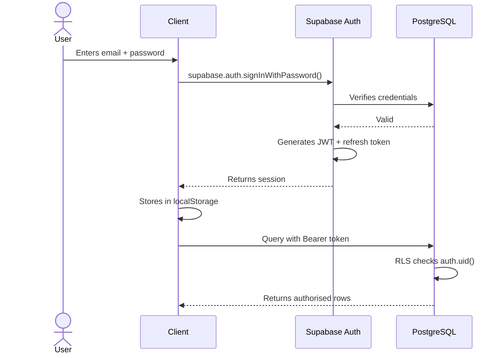

### 10.3 JWT Tokens

| Property | Value |
|----------|-------|
| Algorithm | HS256 |
| Issuer | Supabase |
| Expiry | 1 hour (default) |
| Refresh | Automatic via Supabase JS SDK |
| Storage | localStorage (browser) |
| Claims | sub (user UUID), email, role, exp, iat |

### 10.4 Session Management

The Supabase JS SDK handles sessions automatically: checks localStorage on page load, refreshes expired access tokens, and provides onAuthStateChange listener.

### 10.5 Password Reset

```typescript
await supabase.auth.resetPasswordForEmail(email, {
  redirectTo: 'https://puremaids.co.uk/account/reset-password',
});
```

### 10.6 Email Verification

Email verification is disabled per product requirement. Users can sign in immediately after registration.

### 10.7 Role-Based Access

Roles are not stored in the JWT. The platform uses database tables to determine role:

| Role | Query |
|------|-------|
| Admin | SELECT 1 FROM admin_profiles WHERE user_id = auth.uid() |
| Cleaner | SELECT 1 FROM cleaner_profiles WHERE user_id = auth.uid() |
| Customer | Implicit — authenticated user without admin or cleaner profile |

### 10.8 Multi-Factor Authentication

MFA is not currently implemented. It is on the roadmap for admin accounts.

---

## 11. Authorization

### 11.1 Authorization Model

PureMaids uses Row Level Security (RLS) as the primary authorization mechanism. RLS policies are defined at the PostgreSQL level and enforced for every query.

### 11.2 RBAC vs RLS

| Aspect | RBAC | RLS (PureMaids) |
|--------|------|-----------------|
| Where enforced | Application layer | Database layer |
| Bypass risk | App bugs can leak data | Cannot be bypassed by app code |
| Granularity | Role-level | Row-level |
| Performance | No DB overhead | Minimal with proper indexes |

### 11.3 RLS Policy Pattern

```sql
-- Customer: own rows only
CREATE POLICY "customers_select_own" ON bookings
  FOR SELECT TO authenticated
  USING (auth.uid() = user_id);

-- Cleaner: assigned bookings only
CREATE POLICY "cleaner_select_assigned" ON bookings
  FOR SELECT TO authenticated
  USING (assigned_cleaner_id IN (
    SELECT cleaner_id FROM cleaner_profiles WHERE user_id = auth.uid()
  ));

-- Admin: all rows
CREATE POLICY "admin_select_all" ON bookings
  FOR SELECT TO authenticated
  USING (EXISTS (SELECT 1 FROM admin_profiles WHERE user_id = auth.uid()));
```

### 11.4 Ownership Rules

| Table | Owner column | Rule |
|-------|-------------|------|
| bookings | user_id | auth.uid() = user_id (NULL for guest bookings) |
| payments | user_id | auth.uid() = user_id |
| invoices | user_id | auth.uid() = user_id |
| notifications | user_id | auth.uid() = user_id |
| reviews | user_id | auth.uid() = user_id |
| saved_addresses | user_id | auth.uid() = user_id |
| subscriptions | user_id | auth.uid() = user_id |
| availability | cleaner_id | cleaner_id matches cleaner_profiles |
| job_checkins | cleaner_id | cleaner_id matches cleaner_profiles |
| job_tasks | cleaner_id | cleaner_id matches cleaner_profiles |
| job_photos | cleaner_id | cleaner_id matches cleaner_profiles |
| job_issues | cleaner_id | cleaner_id matches cleaner_profiles |

### 11.5 INSERT Policy Security

After security hardening, INSERT policies enforce strict constraints:

| Table | Constraint |
|-------|-----------|
| bookings (anon) | user_id IS NULL AND status = pending AND deposit_paid = false AND stripe_session_id IS NULL |
| bookings (authenticated) | (user_id IS NULL OR user_id = auth.uid()) AND status = pending AND deposit_paid = false |
| booking_extras (anon) | Referenced booking must have user_id IS NULL AND status = pending |
| booking_extras (authenticated) | Referenced booking owned by caller or unowned, status = pending |
| contact_enquiries | status = new (prevents setting admin fields) |

### 11.6 Function Security

All database functions have SET search_path = public, pg_catalog and SECURITY INVOKER (for RPC functions). EXECUTE revoked from anon on admin-only functions.

---

## 12. Booking Engine

### 12.1 Booking Lifecycle

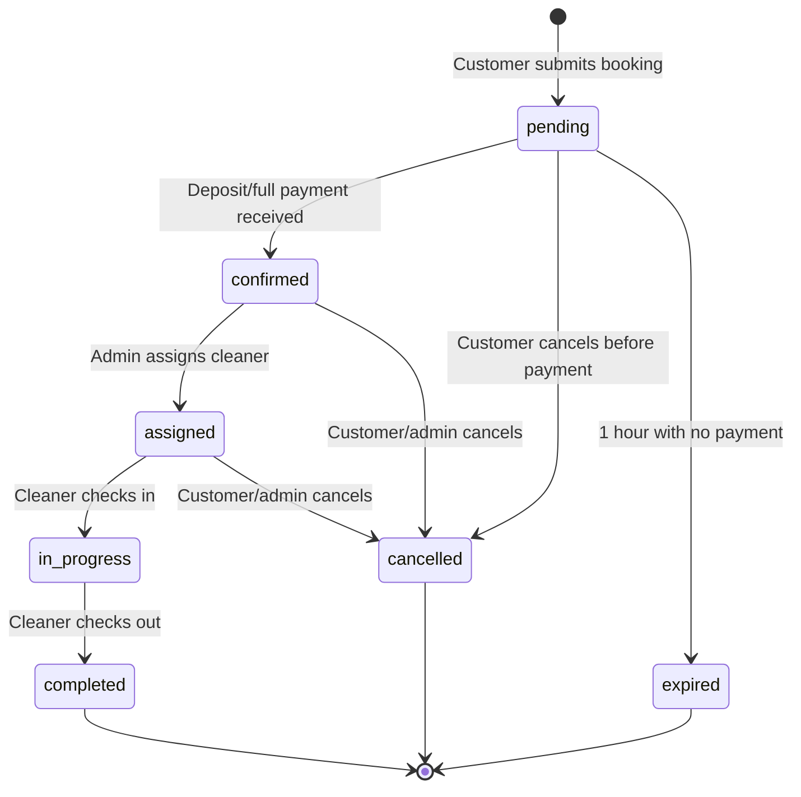

### 12.2 Price Calculation

Pricing is calculated client-side in lib/pricing.ts and stored in the database on booking creation.

```typescript
function calcPrice(serviceKey: string, extraKeys: string[] = []): PriceBreakdown {
  const basePence   = SERVICES[serviceKey].basePence;
  const extrasPence = extraKeys.reduce((s, k) => s + EXTRAS[k].pence, 0);
  const totalPence  = basePence + extrasPence;
  const depositPence = Math.round(totalPence * 20 / 100);
  return { basePence, extrasPence, totalPence, depositPence, balancePence: totalPence - depositPence };
}
```

| Service | Base Price |
|---------|-----------|
| Domestic Cleaning | 59.00 GBP |
| Deep Cleaning | 129.00 GBP |
| End of Tenancy Cleaning | 189.00 GBP |
| Office Cleaning | 99.00 GBP |

| Extra | Price |
|-------|-------|
| Oven Clean | +20.00 GBP |
| Fridge Clean | +15.00 GBP |
| Carpet Shampoo | +35.00 GBP |
| Window Cleaning | +18.00 GBP |
| Skirting Boards | +12.00 GBP |

### 12.3 Booking Reference Generation

The set_booking_reference() trigger generates a unique reference on INSERT:

```sql
NEW.reference := 'PM-' || upper(substring(replace(gen_random_uuid()::text, '-', ''), 1, 8));
-- Example: PM-A3F2B1C9
```

### 12.4 Deposit System

- Deposit is 20% of total price (base + extras)
- Customer can choose to pay the deposit or the full amount at checkout
- Deposit is non-refundable (see Terms and Conditions)
- Balance is due on completion of the service

### 12.5 Cancellation

| Timing | Refund |
|--------|--------|
| More than 48 hours before | Full balance refunded (deposit non-refundable) |
| Within 48 hours | Up to 50% cancellation fee |
| After completion | No refund (satisfaction guarantee applies) |

### 12.6 Recurring Bookings

Recurring bookings (weekly, fortnightly, monthly) are managed through the subscription system. Individual bookings are created from the subscription schedule by admin staff.

### 12.7 Availability and Scheduling

Cleaners set availability through the availability table with three slot types:

| Type | Description | Use Case |
|------|-------------|----------|
| recurring | Weekly recurring slot | Regular working hours |
| specific_date | One-off available date | Working a specific Saturday |
| blocked | Unavailable date/time | Medical appointment |

Availability overrides (availability_overrides table) allow full-day blocks for holidays or sick leave.

### 12.8 Invoices

Invoices are generated automatically with the following numbering scheme:

```sql
-- Trigger: generate_invoice_number() on invoices table
NEW.invoice_number := 'INV-' || to_char(now(), 'YYYY') || '-' ||
  lpad(nextval('invoice_number_seq')::text, 5, '0');
-- Example: INV-2026-00001
```

Invoice fields include subtotal, VAT rate, VAT amount, total, amount paid, and amount due. PDFs are stored in Supabase Storage with the URL recorded in invoices.pdf_url.

---

## 13. Payment System

### 13.1 Stripe Integration Overview

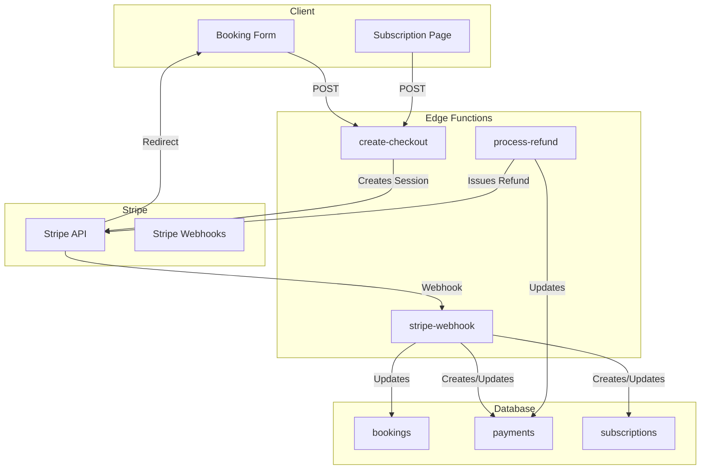

### 13.2 Payment Flow (One-Time)

1. Customer completes the booking wizard and clicks Pay Deposit or Pay in Full
2. Client inserts the booking record into the database (status: pending)
3. Client calls POST /functions/v1/create-checkout with booking details
4. Edge Function creates a Stripe Checkout Session with mode: payment, line item with deposit or total, customer_email, metadata (booking_id, reference, service_type, payment_type), success_url, cancel_url, expires_at (1 hour)
5. Client redirects the browser to the Stripe Checkout URL
6. Customer completes payment on Stripe hosted page
7. Stripe sends checkout.session.completed webhook to the Edge Function
8. Edge Function updates booking (status: confirmed, deposit_paid: true)
9. Edge Function creates a payments record
10. Stripe redirects the customer to /book/success

### 13.3 Payment Flow (Subscription)

1. Customer selects a plan on /subscriptions
2. Client calls POST /functions/v1/create-checkout with mode: subscription
3. Edge Function creates a Stripe Checkout Session with mode: subscription, line item with the plan Stripe Price ID
4. Customer completes checkout on Stripe
5. Stripe sends customer.subscription.created webhook
6. Edge Function creates a subscriptions record

### 13.4 Refunds

Refunds are processed through the admin panel at /admin/refunds:

1. Admin navigates to /admin/refunds
2. Page queries payments where status IN (succeeded, partially_refunded)
3. Admin clicks Refund, enters amount and reason
4. Client calls POST /functions/v1/process-refund with admin JWT
5. Edge Function verifies caller is admin via admin_profiles
6. Edge Function calls stripe.refunds.create()
7. Edge Function updates payments record (refund_amount_pence, refunded_at, status)
8. Stripe sends charge.refunded webhook (additional confirmation)

### 13.5 Webhook Handling

| Event | Action |
|-------|--------|
| checkout.session.completed | Update booking status to confirmed, create payment record |
| payment_intent.payment_failed | Update payment status to failed, set failure_reason |
| customer.subscription.created | Create subscription record |
| customer.subscription.updated | Update subscription status and period dates |
| customer.subscription.deleted | Mark subscription as canceled |
| charge.refunded | Update payment refund_amount_pence and status |

### 13.6 Failure Handling

| Failure | Handling |
|---------|----------|
| Stripe API error during checkout creation | Edge Function returns 500; client displays error alert |
| Payment failure at Stripe | Webhook updates payment to failed; booking remains pending |
| Webhook delivery failure | Stripe retries automatically (up to 3 days); events are idempotent |
| Refund failure | Edge Function returns error; admin sees error message in modal |

---

## 14. Email System

### 14.1 Overview

Transactional emails are sent via Resend through Edge Functions. Emails are composed inline in the function code.

### 14.2 Email Templates

| Template | Trigger | Sender | Subject |
|----------|---------|--------|---------|
| Booking Confirmation | checkout.session.completed webhook | notify-booking function | Your PureMaids Booking is Confirmed |
| Booking Reminder | 24 hours before scheduled clean (cron) | send-reminder function | Reminder: Your cleaning tomorrow |
| Booking Completed | Booking status to completed | notify-booking function | Your Cleaning is Complete |
| Booking Cancelled | Booking status to cancelled | notify-booking function | Booking Cancelled |
| Refund Confirmation | Refund processed | process-refund function | Refund Processed |

### 14.3 Retry Logic

Resend handles retries internally with exponential backoff. The Edge Function itself does not implement retry logic — it fires and forgets.

### 14.4 Notifications vs Email

In-app notifications (notifications table) are generated by PostgreSQL triggers. Email notifications are sent by Edge Functions. These are separate systems:

| Channel | Source | Trigger |
|---------|--------|---------|
| In-app notification | notify_on_booking_status_change() trigger | Database row update |
| Email | notify-booking Edge Function | Stripe webhook or manual trigger |

---

## 15. File Storage

### 15.1 Supabase Storage

| Bucket | Contents | Access Control |
|--------|----------|---------------|
| invoices | Generated PDF invoices | Customer can read own; admin can read all |
| job-photos | Before/after photos uploaded by cleaners | Cleaner can read/write own; admin can read all |

### 15.2 Invoice PDFs

Invoice PDFs are generated and uploaded to the invoices bucket. The URL is stored in invoices.pdf_url. Access is controlled by storage policies that check ownership via the invoice user_id column.

### 15.3 Job Photos

Cleaners upload before/after photos during a job. Photos are uploaded to the job-photos bucket, and the URL is stored in job_photos.photo_url with a type (before, after, issue).

### 15.4 Security

- Storage bucket policies enforce ownership checks
- File uploads are authenticated — no public uploads
- File URLs are signed URLs with expiration for private buckets
- Public buckets are not used for user-generated content

---

## 16. Logging

### 16.1 Application Logs

| Layer | Logging Mechanism |
|-------|-------------------|
| Next.js client | console.error() captured by ErrorBoundary component |
| Next.js server | Next.js built-in logging |
| Edge Functions | console.log() / console.error() captured by Supabase platform |
| Database | RAISE NOTICE / RAISE EXCEPTION in PL/pgSQL functions |

### 16.2 Audit Logs

Audit logging is not currently implemented at the database level. The updated_at columns on all tables provide a basic audit trail of when records were last modified. Roadmap: dedicated audit_logs table with triggers.

### 16.3 Security Logs

| Event | Logged Where |
|-------|-------------|
| Failed login attempt | Supabase Auth logs |
| RLS policy violation | PostgreSQL logs (Supabase dashboard) |
| Stripe webhook received | Edge Function console output |
| Refund processed | payments table (refund_amount_pence, refunded_at) |

### 16.4 Error Logs

Client-side errors are caught by the ErrorBoundary component and displayed to the user. For production error tracking, integrate with Sentry or similar (roadmap).

---

## 17. Error Handling

### 17.1 Global Exception Handling

| Layer | Mechanism |
|-------|-----------|
| Next.js App Router | app/global-error.tsx catches unhandled errors in any route |
| React components | ErrorBoundary component wraps client components |
| Next.js 404 | app/not-found.tsx custom 404 page |
| Route loading | app/loading.tsx spinner during route transitions |

### 17.2 Validation

| Layer | Mechanism |
|-------|-----------|
| Client-side forms | Field-level validation in booking wizard (email regex, required fields, GDPR consent) |
| Database | NOT NULL constraints, CHECK constraints, foreign keys |
| Edge Functions | Input validation at function entry; JSON error responses |

### 17.3 API Error Handling

All Edge Functions follow a consistent error pattern:

```typescript
try {
  // business logic
} catch (err) {
  const msg = err instanceof Error ? err.message : 'Unknown error';
  return new Response(JSON.stringify({ error: msg }), {
    status: 500,
    headers: { ...corsHeaders, 'Content-Type': 'application/json' },
  });
}
```

### 17.4 Retry Strategy

| Operation | Retry Strategy |
|-----------|---------------|
| Stripe API calls | Stripe SDK handles retries internally (up to 3) |
| Resend email | Resend handles retries internally |
| Database queries | No retry — errors surface immediately |
| Webhook delivery | Stripe retries for up to 3 days with exponential backoff |

### 17.5 Graceful Failures

| Scenario | User Experience |
|----------|-----------------|
| Stripe Checkout creation fails | Error alert on booking form; user can retry |
| Payment fails at Stripe | Redirected to /book/cancel page |
| Database insert fails | Error alert; user can retry |
| Edge Function is down | Error alert; user can retry or call phone |
| Image fails to load | Alt text displayed; layout shift prevented by next/image |

---

## 18. Testing

### 18.1 Testing Strategy

| Level | Tool | Status |
|-------|------|--------|
| Unit tests | Jest | Planned |
| Integration tests | Jest + Supertest | Planned |
| API tests | Edge Function invocation tests | Planned |
| E2E tests | Playwright | Planned |
| Security tests | Supabase Security Advisor | Active — all issues resolved |
| Performance tests | Lighthouse | Manual |
| Database tests | pgTAP | Planned |

### 18.2 Test Coverage Goals

| Area | Target Coverage |
|------|----------------|
| lib/pricing.ts | 100% — pure function, no side effects |
| lib/constants.ts | N/A — static data |
| Booking wizard | 80% — critical user flow |
| Edge Functions | 80% — payment-critical |
| RLS policies | 100% — security-critical |

### 18.3 Security Testing

The platform has been audited by the Supabase Security Advisor. All identified issues have been resolved:

- SECURITY DEFINER views converted to SECURITY INVOKER
- Mutable search_path functions fixed with SET search_path = public, pg_catalog
- Always-true RLS policies tightened with proper WITH CHECK clauses
- Public execution of admin functions revoked (EXECUTE from anon)

### 18.4 Performance Testing

Lighthouse targets:

| Metric | Target |
|--------|--------|
| Performance | > 90 |
| Accessibility | > 95 |
| SEO | 100 |
| LCP (Largest Contentful Paint) | < 2 seconds |
| First Load JS (shared) | < 100 kB |

---

## 19. Deployment

### 19.1 Environments

| Environment | Purpose | URL |
|-------------|---------|-----|
| Development | Local development | http://localhost:3000 |
| Staging | Pre-production testing | https://staging.puremaids.co.uk |
| Production | Live customer-facing | https://puremaids.co.uk |

### 19.2 Deployment Process

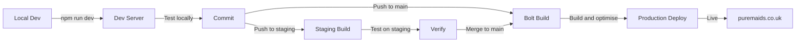

### 19.3 Build Process

```bash
npm ci          # Install dependencies (deterministic)
npm run build   # Compile TypeScript, ESLint, SSG, SSR, image optimisation
npm start       # Start production server
```

### 19.4 Edge Function Deployment

Edge Functions are deployed using the Supabase MCP deploy_edge_function tool. The function source must be written to supabase/functions/<slug>/index.ts before deployment.

### 19.5 Database Migrations

Database migrations are applied using the Supabase MCP apply_migration tool. Each migration is a SQL file with a timestamped filename. Migrations are tracked in the supabase_migrations.schema_migrations table.

### 19.6 Rollback

| Component | Rollback Strategy |
|-----------|-------------------|
| Next.js app | Bolt platform supports instant rollback to previous deployment |
| Edge Functions | Redeploy previous version using deploy_edge_function MCP tool |
| Database migrations | Manual SQL to reverse the migration (no automated rollback) |

### 19.7 Backups

| Component | Backup Strategy |
|-----------|-----------------|
| Database | Supabase automatic daily backups (point-in-time recovery) |
| Storage | Supabase Storage replication |
| Code | Git repository (all versions) |
| Stripe data | Stripe dashboard (all transaction history) |

### 19.8 CI/CD

CI/CD is managed by the Bolt platform. On push to main:

1. Dependencies are installed (npm ci)
2. The application is built (npm run build)
3. If the build succeeds, the new version is deployed
4. If the build fails, the previous version remains live

---

## 20. Monitoring

### 20.1 Health Checks

| Check | Method | Alert Condition |
|-------|--------|-----------------|
| Next.js server | Bolt platform health check | HTTP 5xx response rate > 1% |
| Supabase database | Supabase dashboard | Connection pool exhausted |
| Edge Functions | Supabase dashboard | Error rate > 5% |
| Stripe webhooks | Stripe dashboard | Webhook delivery failure |

### 20.2 Metrics

| Metric | Source | Target |
|--------|--------|--------|
| First Load JS (shared) | Next.js build output | < 100 kB |
| Page load time | Lighthouse | < 2 seconds (LCP) |
| Lighthouse performance | Lighthouse | > 90 |
| Lighthouse accessibility | Lighthouse | > 95 |
| Lighthouse SEO | Lighthouse | 100 |
| Database query time | Supabase dashboard | < 100ms (p95) |

### 20.3 Alerts

Alerts are not currently automated. Manual monitoring via Bolt platform dashboard, Supabase dashboard, and Stripe dashboard. Roadmap: integrate Sentry for automated error alerting.

---

## 21. Scalability

### 21.1 Current Architecture Limits

| Component | Limit | Mitigation |
|-----------|-------|------------|
| Next.js (Bolt) | Auto-scaled by platform | No action needed |
| Supabase database | Connection pool size | Use connection pooling; avoid long-running queries |
| Edge Functions | Concurrent invocations | Auto-scaled by Supabase |
| Stripe API | Rate limits (100 req/sec) | Not likely to hit; webhooks are async |

### 21.2 Horizontal Scaling

The Next.js application is stateless and can be scaled horizontally by the Bolt platform. Edge Functions are also stateless and auto-scaled by Supabase. The only stateful component is the PostgreSQL database.

### 21.3 Database Scaling

| Technique | Status | Notes |
|-----------|--------|-------|
| Connection pooling | Active | Supabase PgBouncer |
| Read replicas | Available | Supabase supports read replicas for read-heavy workloads |
| Partitioning | Not needed | Current data volume does not require partitioning |
| Indexing | Active | All foreign keys and frequently queried columns are indexed |

### 21.4 Caching

| Layer | Strategy |
|-------|----------|
| Next.js | Static generation for content pages; Cache-Control headers |
| CDN | Bolt edge CDN caches static assets |
| Database | Supabase connection pooling |
| Client | Browser cache for static assets; service worker (roadmap) |

### 21.5 Future Scaling Considerations

- Implement Redis for session caching and rate limiting
- Add a job queue for background tasks
- Implement CDN caching for API responses with stale-while-revalidate
- Consider database partitioning when bookings exceed 1M rows

---

## 22. Troubleshooting

### 22.1 Common Issues

| Issue | Cause | Solution |
|-------|-------|----------|
| Missing Supabase env vars | Environment variables not set | Check .env.local has NEXT_PUBLIC_SUPABASE_URL and NEXT_PUBLIC_SUPABASE_ANON_KEY |
| Build fails with metadata export from use client | Metadata export in a use client component | Move metadata to a separate server component or remove it |
| Stripe Checkout redirect fails | Invalid Stripe key or wrong price ID | Check STRIPE_SECRET_KEY is set and valid; verify price IDs in Stripe dashboard |
| Webhook not received | Stripe webhook endpoint not configured | Use Stripe CLI for local dev; ensure webhook URL is publicly accessible in production |
| RLS policy blocks legitimate access | Policy condition too restrictive | Check auth.uid() is present in the session; verify policy conditions |
| Edge Function returns CORS error | Missing CORS headers | Ensure all responses include corsHeaders (including OPTIONS and error responses) |
| Function search_path mutable warning | Function lacks SET search_path | Add SET search_path = public, pg_catalog to function definition |
| Booking insert fails with RLS error | INSERT policy conditions not met | Ensure status = pending, user_id IS NULL (for anon), deposit_paid = false |

### 22.2 Debugging

| Task | How |
|------|-----|
| View Edge Function logs | Supabase dashboard, Functions, select function, Logs |
| View database queries | Supabase dashboard, SQL Editor, run diagnostic queries |
| Test RLS policies | Supabase SQL Editor with SET ROLE anon or SET ROLE authenticated |
| Debug Stripe webhooks | Stripe dashboard, Developers, Webhooks, view event details |
| Debug auth issues | Supabase dashboard, Authentication, Users |
| Check migration status | SELECT * FROM supabase_migrations.schema_migrations |

### 22.3 Useful Diagnostic Queries

```sql
-- Check RLS is enabled on all tables
SELECT tablename, rowsecurity FROM pg_tables
WHERE schemaname = 'public' ORDER BY tablename;

-- Check all policies for a table
SELECT * FROM pg_policies
WHERE schemaname = 'public' AND tablename = 'bookings';

-- Check function security settings
SELECT proname, prosecdef, proconfig
FROM pg_proc p JOIN pg_namespace n ON n.oid = p.pronamespace
WHERE n.nspname = 'public';

-- Check active bookings
SELECT status, COUNT(*) FROM bookings GROUP BY status;

-- Check recent payments
SELECT id, amount_pence, status, created_at
FROM payments ORDER BY created_at DESC LIMIT 10;
```

---

## 23. Future Roadmap

### 23.1 Planned Modules

| Module | Priority | Description |
|--------|----------|-------------|
| Customer auth | High | Sign up / sign in / sign out pages with Supabase Auth |
| Cleaner portal | High | Dashboard for cleaners to view schedule, check in/out, complete tasks |
| Admin dashboard | High | Full admin panel for booking management, cleaner assignment, revenue reports |
| Automated invoicing | High | Generate and email invoices automatically on payment completion |
| SMS notifications | Medium | Twilio integration for SMS booking reminders |
| Google Calendar sync | Medium | Two-way sync between booking schedule and Google Calendar |
| MFA for admins | Medium | Multi-factor authentication for admin accounts |
| Audit logging | Medium | Dedicated audit_logs table with triggers on all tables |
| Service area pages | Medium | Individual landing pages for each service area with local SEO |
| Blog/CMS | Low | Content management system for SEO blog articles |
| Mobile app | Low | React Native app for customers and cleaners |
| AI scheduling | Low | Automatic cleaner assignment based on availability, location, and skills |
| Loyalty programme | Low | Points-based loyalty system for repeat customers |
| Team cleaning | Low | Support for multi-cleaner jobs (large properties) |
| Inventory management | Low | Track cleaning supplies and equipment per cleaner |
| Real-time tracking | Low | Live GPS tracking of cleaners during jobs |
| Ratings analytics | Low | Dashboard for analysing review trends and customer satisfaction |

---

## 24. Contributing

### 24.1 Development Workflow

1. Create a branch: git checkout -b feature/your-feature-name
2. Make changes following the coding conventions below
3. Test locally: npm run dev and verify your changes
4. Run the build: npm run build — ensure no errors or warnings
5. Commit using conventional commit messages
6. Push and create a PR describing your changes clearly

### 24.2 Coding Conventions

| Convention | Rule |
|------------|------|
| Language | TypeScript — strict mode |
| Framework | Next.js 14 App Router |
| Styling | Tailwind CSS — use design system classes from globals.css |
| File naming | kebab-case for files; PascalCase for components |
| Component type | use client only when interactivity is required; default to server components |
| Imports | Use @/ alias (configured in tsconfig.json) |
| Functions | Add SET search_path = public, pg_catalog to all PostgreSQL functions |
| RLS | Every new table must have RLS enabled with per-role policies |
| Security | Never use SUPABASE_SERVICE_ROLE_KEY in client code |
| Comments | Minimal — only for non-obvious WHY, never for WHAT |

### 24.3 Conventional Commits

```
feat: add subscription cancellation flow
fix: correct deposit calculation for rounded amounts
docs: update README with database schema
refactor: extract price calculation to lib/pricing.ts
chore: upgrade Next.js to 14.1.0
```

### 24.4 Pull Request Checklist

- [ ] Build passes (npm run build)
- [ ] No new TypeScript errors
- [ ] RLS policies added for any new tables
- [ ] search_path set on any new database functions
- [ ] No secrets committed to git
- [ ] No SUPABASE_SERVICE_ROLE_KEY in client code
- [ ] Responsive design verified (mobile + desktop)
- [ ] Accessibility checked (keyboard navigation, ARIA labels)
- [ ] SEO metadata set for new pages

---

## 25. Appendix

### 25.1 Glossary

| Term | Definition |
|------|-----------|
| RLS | Row Level Security — PostgreSQL feature restricting row access based on policy conditions |
| SECURITY DEFINER | Function executes with owner privileges, not caller |
| SECURITY INVOKER | Function executes with caller privileges |
| search_path | PostgreSQL setting determining schema search order for unqualified names |
| JWT | JSON Web Token — compact, URL-safe token for authentication |
| Edge Function | Serverless function running on Supabase Deno runtime |
| DBS | Disclosure and Barring Service — UK criminal record check |
| ICO | Information Commissioner's Office — UK data protection regulator |
| GDPR | General Data Protection Regulation — EU/UK data protection law |
| CSP | Content Security Policy — HTTP header restricting resource loading |
| HSTS | HTTP Strict Transport Security — forces HTTPS connections |
| PWA | Progressive Web App — installable web application |
| SSR | Server-Side Rendering — HTML generated on server |
| SSG | Static Site Generation — HTML generated at build time |
| PgBouncer | PostgreSQL connection pooler used by Supabase |
| Stripe Checkout | Stripe hosted payment page |
| Stripe Webhook | HTTP notification from Stripe when an event occurs |
| Deposit | Partial payment (20%) required to secure a booking |
| Booking reference | Human-readable unique identifier (e.g. PM-A3F2B1C9) |

### 25.2 Useful Commands

```bash
# Development
npm run dev          # Start dev server
npm run build        # Production build
npm run start        # Start production server
npm run lint         # Run ESLint

# Supabase (via MCP tools)
# Apply migration:  use mcp__supabase__apply_migration
# Execute SQL:      use mcp__supabase__execute_sql
# Deploy function:  use mcp__supabase__deploy_edge_function
# List tables:      use mcp__supabase__list_tables
# List migrations:  use mcp__supabase__list_migrations
# List functions:   use mcp__supabase__list_edge_functions
# List secrets:     use mcp__supabase__list_edge_function_secrets

# Stripe CLI (local development)
stripe listen --forward-to <webhook-url>
stripe trigger checkout.session.completed
```

### 25.3 Security Headers Reference

| Header | Value | Purpose |
|--------|-------|---------|
| Strict-Transport-Security | max-age=63072000; includeSubDomains; preload | Force HTTPS for 2 years |
| Content-Security-Policy | default-src self; ... | Prevent XSS, data injection |
| X-Frame-Options | SAMEORIGIN | Prevent clickjacking |
| X-Content-Type-Options | nosniff | Prevent MIME sniffing |
| X-XSS-Protection | 1; mode=block | Legacy XSS protection |
| Referrer-Policy | strict-origin-when-cross-origin | Limit referrer information |
| Permissions-Policy | camera=(), microphone=(), ... | Restrict browser APIs |

### 25.4 References

| Resource | URL |
|----------|-----|
| Next.js documentation | https://nextjs.org/docs |
| Supabase documentation | https://supabase.com/docs |
| Stripe documentation | https://stripe.com/docs |
| Resend documentation | https://resend.com/docs |
| Tailwind CSS documentation | https://tailwindcss.com/docs |
| PostgreSQL RLS documentation | https://www.postgresql.org/docs/current/ddl-rowsecurity.html |
| UK GDPR guidance | https://ico.org.uk |
| WCAG 2.1 guidelines | https://www.w3.org/TR/WCAG21/ |
| Mermaid diagram syntax | https://mermaid.js.org/syntax/ |

---

Document Version: 1.0.0
Last Updated: January 2026
Maintained by: PureMaids Engineering Team
License: Proprietary — PureMaids Ltd
